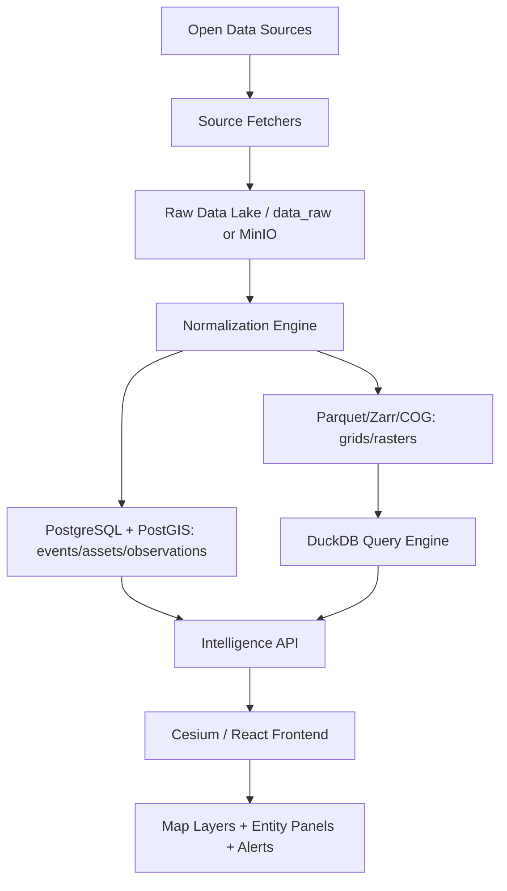
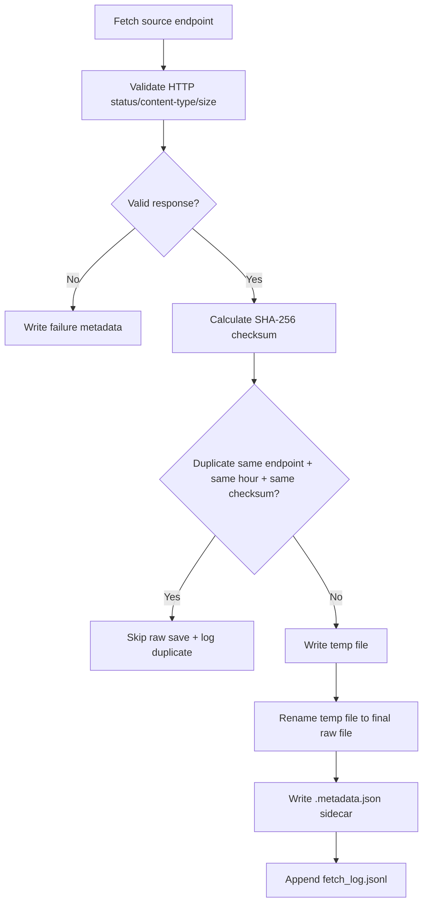
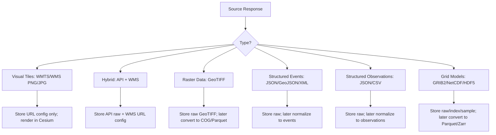

<!-- ============================================== --><!-- CONTENT FROM: god_eyes_project_report.md --><!-- ============================================== -->

# God Eyes / Open Intelligence Earth Platform — Project Report

**Document type:** Markdown planning report  
**Scope:** Everything discussed so far about the project direction, data sources, raw-fetch pipeline, storage architecture, normalization/database roadmap, and intelligence goals.  
**Current focus:** Stage 1 — raw data fetching and raw storage for weather, hazards, disaster, and Earth-intelligence sources.

---

## 1. Project Vision

We are building a **global open-source intelligence and Earth-awareness platform**. The idea is inspired by tools like Zoom Earth for weather visualization and by intelligence platforms that fuse many types of data, but this project is based on **public, open, free, or free-tier data sources**.

The project should not be only a map. It should become a system that can answer:

```txt
What is happening here?
What changed recently?
What assets are nearby?
What hazards are active?
Who or what is affected?
How confident are we?
Which sources support this conclusion?
What should we watch next?
```

The long-term idea is:

```txt
collect → store raw → normalize → connect → compare → score → explain → alert → visualize
```

The project should eventually behave like an **open-data intelligence fusion engine**, not just a data viewer.

---

## 2. Current Repository Direction Discussed

The active development folder is:

```txt
explorer/
```

The project direction discussed so far:

```txt
Frontend:
- React
- TypeScript
- Vite
- Cesium / Resium
- Zustand-style state management
- 3D globe UI
- layer panels
- entity details panels
- telemetry / HUD panels

Backend:
- Node.js / .mjs server
- source fetchers
- raw data capture
- future normalization workers
- future Postgres/PostGIS + DuckDB + Parquet lakehouse
```

Existing project features already discussed:

```txt
- Cesium globe
- terrain / 3D Earth view
- OSM buildings
- search
- imagery picker
- live flights
- flight selection/details
- focus/track/chase/cockpit camera modes
- aviation grid
- weather fallback chain
- railway / metro / transit overlays
- server routes for multiple live intelligence layers
```

Immediate earlier recommendation:

```txt
Do not add unlimited datasets randomly.
First stabilize data architecture.
Start with aviation intelligence UI, weather/hazard raw fetch, source health, and fetch pipeline reliability.
```

---

## 3. Platform Domains / Factors We Want To Cover

The platform is not only weather. The full intelligence scope includes:

```txt
1. Weather / atmosphere
2. Radar / precipitation
3. Satellite imagery
4. Clouds / smoke / dust / ash
5. Earthquakes
6. Volcanoes
7. Tsunami
8. Wildfire
9. Floods / hydrology
10. Ocean / marine hazards
11. Air quality / health environment
12. Climate / historical anomaly
13. Land / vegetation / agriculture
14. Population / exposure / vulnerability
15. Critical infrastructure
16. Aviation
17. Maritime / ships / ports
18. Roads / rail / transit
19. Energy / power / pipelines
20. News / events / geopolitics
21. Conflict / protests / humanitarian risk
22. Economy / trade / supply chain
23. Military / restricted aviation indicators where public/open data allows
24. Alerts / warnings / official emergency signals
25. Derived intelligence scores and risk products
```

Important distinction:

```txt
Weather = atmosphere
Hydrology = water on land
Geology = Earth crust
Marine = ocean
Fire = fire + land + weather
Environment = air/land quality
Disaster = impact on people/assets
```

Frontend can show these under a friendly section like:

```txt
Weather & Disasters
```

Backend should keep them separated internally.

---

## 4. High-Level Architecture Diagram



Core principle:

```txt
Raw files are truth.
Normalized records are usable data.
Database stores relationships.
Parquet stores huge grids.
DuckDB queries analytics.
Frontend visualizes only.
```

---

## 5. Lakehouse Architecture Decision

The selected architecture is a **Data Lakehouse** pattern.

```txt
Raw lake:
- data_raw/ locally first
- MinIO/S3 later
- raw JSON, GeoJSON, XML, CSV, GRIB2, NetCDF, HDF5, GeoTIFF exactly as received

Database:
- PostgreSQL + PostGIS for events, assets, observations, alerts, relationships

Analytical lake:
- Parquet / Zarr / COG for huge grids and rasters

Query engine:
- DuckDB for Parquet and large analytical queries

Frontend:
- Cesium renders layers and calls backend intelligence APIs
```

Why this is correct:

```txt
Do not put huge weather grids into PostgreSQL.
Do not force every source into one format.
Do not normalize before saving raw.
Do not download every tile blindly.
```

---

## 6. Stage Plan

```txt
Stage 1: Raw fetch + raw storage
Stage 2: Normalization engine
Stage 3: Database schema + insertion
Stage 4: Query engine + source fusion
Stage 5: Intelligence products + alerts
Stage 6: Frontend visualization + investigation workflows
```

Current conversation and implementation focus:

```txt
Stage 1 only.
No database.
No normalization.
No frontend wiring.
```

---

## 7. Stage 1 Raw Fetch Pipeline

Stage 1 goal:

```txt
Fetch data from sources.
Validate it lightly.
Save raw response exactly as received.
Write metadata sidecar.
Write JSONL fetch log.
Deduplicate identical payloads.
Keep failures isolated.
Do not normalize.
```

Stage 1 flow:



Mandatory Stage 1 rules:

```txt
1. Save raw before normalization.
2. Never change raw files.
3. Never mix sources in one folder.
4. Always write metadata sidecar.
5. Always write fetch log.
6. Use safe temp-file write + rename.
7. Use checksums to dedupe.
8. Use failure isolation.
9. Use retry/backoff later for production hardening.
10. Keep data_raw out of Git.
```

---

## 8. Raw Folder Structure

The chosen folder structure:

```txt
explorer/data_raw/weather/
  <source>/
    <folder_or_dataType>/
      year=YYYY/
        month=MM/
          day=DD/
            hour=HH/
              <source>_<datatype>_<timestamp>.<ext>
              <source>_<datatype>_<timestamp>.<ext>.metadata.json
```

Example:

```txt
explorer/data_raw/weather/gdacs/cyclones/year=2026/month=04/day=30/hour=19/gdacs_cyclones_7d_2026-04-30T19-14-57-293Z.xml
explorer/data_raw/weather/gdacs/cyclones/year=2026/month=04/day=30/hour=19/gdacs_cyclones_7d_2026-04-30T19-14-57-293Z.xml.metadata.json
```

Earlier conceptual structure:

```txt
/data/raw/
 └── weather/
      ├── open_meteo/
      ├── noaa_nws/
      ├── noaa_gfs/
      ├── noaa_ncei/
      ├── copernicus_era5/
      ├── nasa_gpm/
      ├── earthquakes/usgs/
      ├── fires/nasa_firms/
      ├── alerts/gdacs/
      ├── oceans/noaa_dart/
      ├── oceans/noaa_ndbc/
      ├── hydrology/usgs_water/
      ├── hydrology/noaa_nwps/
      ├── hydrology/copernicus_glofas/
      ├── air_quality/openaq/
      ├── air_quality/copernicus_cams/
      ├── satellite/nasa_gibs/
      ├── satellite/noaa_goes/
      ├── satellite/nasa_modis/
      ├── cyclones/noaa_nhc/
      ├── cyclones/jtwc/
      ├── geology/usgs_volcano/
      ├── geology/smithsonian_gvp/
      ├── land/copernicus_land/
      └── population/worldpop/
```

Final implementation can be either grouped by source-first or domain-first, but the rule remains:

```txt
One source must have a clean isolated raw folder.
```

---

## 9. Metadata Sidecar Standard

Current metadata example shape:

```json
{
  "source": "gdacs",
  "folder": "cyclones",
  "dataType": "cyclones_7d",
  "expected": "GDACS tropical cyclones in the last week RSS/XML feed.",
  "endpoint": "https://gdacs.org/xml/rss_tc_7d.xml",
  "fetchedAt": "2026-04-30T19:14:57.293Z",
  "status": "success",
  "httpStatus": 200,
  "httpStatusText": "OK",
  "contentType": "application/xml",
  "bytes": 1021,
  "checksumSha256": "...",
  "durationMs": 202,
  "rawFilePath": "...",
  "metadataPath": "...",
  "sampleShape": {
    "kind": "rss_or_xml",
    "itemCount": 0,
    "preview": "<?xml version=..."
  }
}
```

This was judged correct.

Recommended additions for later:

```txt
runId
attempt
isDuplicate
isValid
validationError
isEmpty
emptyReason
savedAt
retentionTier
expiresAt
fetcherVersion
apiVersion or datasetVersion
```

Important rule:

```txt
itemCount = 0 is not failure.
It means valid empty feed.
```

---

## 10. Retention Policy

Basic policy discussed:

```txt
Tier 1 / Tier 2 JSON/XML/CSV raw files:
- keep full raw files for 30 days
- optionally keep one daily snapshot for 6–12 months

Tier 3 huge GRIB2/NetCDF raw files:
- keep full raw files for 7 days
- optionally keep one representative model-cycle sample/index

Tier 4 / Tier 5 static or slow data:
- keep longer if not huge
- keep metadata/version references
```

Never blindly delete:

```txt
- last successful file
- metadata logs
- daily snapshot if configured
```

---

## 11. Fetch Reliability Safeguards

Safeguards discussed:

```txt
Pre-save validation:
- HTTP status == 200
- expected content-type
- file size > 0
- JSON parse if JSON
- XML/RSS shape if XML
- CSV header if CSV
- binary magic/extension checks for GRIB/NetCDF/HDF/GeoTIFF later
- reject HTML error pages pretending to be data

Deduplication:
- endpoint + SHA-256 checksum + same hour
- skip identical data

Safe write:
- write temp file
- rename to final

Failure isolation:
- one bad feed must not stop the rest

Retry/backoff:
- 1 min, 2 min, 4 min, 8 min, 16 min
- jitter recommended

Dead-letter queue:
- source_id
- endpoint
- retry count
- last error
- last success

Circuit breaker:
- if repeated failures, stop hitting that source temporarily
```

---

## 12. Fetch Frequency Tiers

| Tier | Frequency | Sources / Examples | Purpose |
|---|---:|---|---|
| Tier 1 | 1–15 min / adaptive | USGS earthquakes, NWS alerts, GDACS, FIRMS, DART/NDBC | emergency/event feeds |
| Tier 2 | 10–60 min | Open-Meteo current, OpenAQ, USGS Water, NWPS, NASA GPM | operational observations |
| Tier 3 | model cycle | GFS, NHC/JTWC cyclone advisories | forecast cycles |
| Tier 4 | daily / 12h–daily | ERA5, CAMS, GloFAS, MODIS | slow analytical products |
| Tier 5 | weekly/monthly/yearly | volcano references, land cover, WorldPop | static/reference data |

Specific schedule decisions:

```txt
USGS Earthquakes → 1–5 min
NOAA/NWS Alerts → 2–5 min
GDACS → 5–10 min
NASA FIRMS → 10–15 min
NOAA DART/NDBC → 15–60 min normal, 1–2 min during tsunami trigger
Open-Meteo current → 10–15 min
Open-Meteo forecast → 1 hour
USGS Water → 15–60 min
OpenAQ → 30–60 min
NOAA NWPS → 1 hour
NASA GPM/IMERG → 30–60 min
NOAA GFS → 4x/day after release
NHC/JTWC → 6h normal, 1–3h near landfall
ERA5 → daily/batch
CAMS → 12h–daily
GloFAS → 6–24h/daily
MODIS → 1–2 days
Smithsonian/USGS Volcano reference → weekly
Copernicus Land → monthly
WorldPop → yearly/metadata first
```

Adaptive triggers:

```txt
Earthquake magnitude > 6.5 near ocean → DART polling 1–2 min
Active cyclone near land → cyclone polling 1–3h
Flood warning active → USGS Water/NWPS polling 15 min
Severe weather alert active → NWS alerts 2–5 min
Large wildfire detected → increase fire + wind/weather regional checks
```

---

## 13. Source Type Handling



Type groups:

```txt
TYPE_A = visual tiles
- NASA GIBS
- possible GOES tile products

TYPE_B = hybrid
- NASA FIRMS
- Copernicus GloFAS

TYPE_C = raster data
- WorldPop
- Copernicus Land

TYPE_D = structured events
- USGS Earthquake
- GDACS
- USGS Volcano
- NWS alerts

TYPE_E = structured observations
- Open-Meteo
- OpenAQ
- USGS Water
- NOAA NWPS

TYPE_F = grid models
- NOAA GFS
- ERA5
- CAMS
- GPM
```

---

## 14. 21 Main Sources Discussed

| # | Source | Main use | Access status |
|---:|---|---|---|
| 1 | Open-Meteo | current/hourly/daily weather | no API key |
| 2 | NOAA/NWS API | U.S. alerts, forecasts, observations | no key, User-Agent required |
| 3 | NOAA NCEI CDO | historical climate/weather | API token required |
| 4 | NOAA NODD/GFS | global forecast model data | public cloud/file access |
| 5 | NASA GIBS/Worldview | satellite imagery layers | public tiles; some Earthdata auth for advanced data |
| 6 | NOAA GOES | geostationary satellite files | public S3 |
| 7 | NASA FIRMS | active fires | free MAP_KEY required |
| 8 | USGS Earthquake | earthquake feeds/details | no key |
| 9 | USGS Water | stream gauges/water data | no key |
| 10 | NOAA NWPS/NWM | river forecasts/flood stage | public access |
| 11 | NOAA DART/NDBC | tsunami/ocean buoy data | public access |
| 12 | Copernicus ERA5/CDS | reanalysis/climate baselines | account/token/job API |
| 13 | Copernicus CAMS | air quality/aerosols/smoke/dust | account/token/job API |
| 14 | OpenAQ | ground air quality observations | API key required |
| 15 | Copernicus Land/CLMS | land cover/soil/vegetation/snow | account may be required depending product |
| 16 | NASA MODIS/Earthdata | NDVI/EVI/LST/fire/snow products | Earthdata account/token for many downloads |
| 17 | Smithsonian GVP | volcano reference/reports | public |
| 18 | USGS Volcano Hazards | volcano alerts/notices | public |
| 19 | GDACS | global disaster alerts | public feeds |
| 20 | Copernicus EMS/GloFAS | flood monitoring/forecasts | account/job/API access |
| 21 | WorldPop | population/exposure grids | public metadata/downloads |

Access grouping:

```txt
No-auth/direct:
- Open-Meteo
- NOAA/NWS
- NOAA NODD/GFS listings/indexes
- NASA GIBS public tiles/capabilities
- NOAA GOES public S3 metadata/listings
- USGS Earthquake
- USGS Water
- NOAA NWPS
- NOAA DART/NDBC
- Smithsonian GVP
- USGS Volcano
- GDACS
- WorldPop metadata/download references

API key/token required:
- NOAA NCEI
- NASA FIRMS
- OpenAQ

Account/job/heavy-data workflow:
- Copernicus ERA5/CDS
- Copernicus CAMS
- Copernicus GloFAS
- NASA MODIS/Earthdata
- Copernicus Land partial
- NASA GIBS advanced Earthdata products partial
```

---

## 15. No-Auth Weather Source Fetchers V1 Plan

The no-auth fetcher plan was reviewed and accepted.

Target files:

```txt
explorer/source-fetchers/weather/config/watch_locations.json
explorer/source-fetchers/weather/config/no_auth_source_manifest.mjs

open_meteo_fetcher.mjs
noaa_nws_fetcher.mjs
noaa_nodd_gfs_fetcher.mjs
nasa_gibs_fetcher.mjs
noaa_goes_fetcher.mjs
usgs_earthquake_fetcher.mjs
usgs_water_fetcher.mjs
noaa_nwps_fetcher.mjs
noaa_dart_fetcher.mjs
smithsonian_gvp_fetcher.mjs
usgs_volcano_fetcher.mjs
gdacs_fetcher.mjs
worldpop_fetcher.mjs
```

Design choices:

```txt
- location APIs use configurable watch_locations.json
- huge sources use metadata/index/sample fetches only in v1
- no full GRIB2/NetCDF/GeoTIFF/tile bulk ingestion yet
- raw capture only
- no DB
- no normalization
- no frontend wiring
```

---

## 16. Common Functions Refactor Plan

Shared helper folder:

```txt
explorer/source-fetchers/weather/common_functions/
```

Planned helper modules:

```txt
time.mjs
names.mjs
paths.mjs
checksum.mjs
http_client.mjs
shape_detector.mjs
duplicate_detector.mjs
fetch_log.mjs
failure_writer.mjs
raw_writer.mjs
feed_runner.mjs
cli_summary.mjs
index.mjs
```

Recommended additions:

```txt
config_validator.mjs
content-type to extension map
streaming checksum support
max response size guard
AbortController timeout support
per-feed rate limit config
file lock / safe temp rename
log levels
source health summary
retry/backoff hooks
```

Goal:

```txt
Each source fetcher should mostly contain:
- FEEDS config
- rare source-specific URL builders/discovery logic
- runner function
```

---

## 17. Current Raw Fetch Implementation Status Discussed

Implemented and reported:

```txt
usgs_fetcher.mjs
gdacs_fetcher.mjs
```

Reported behavior:

```txt
- saves raw outputs under explorer/data_raw/weather
- fetches USGS earthquakes, earthquake details, water values, volcano status, elevated volcanoes, notices
- fetches GDACS all-events, earthquakes, cyclones, floods, volcano feeds, wildfire map data
- writes raw files exactly as received
- writes .metadata.json sidecars
- appends to explorer/data_raw/weather/fetch_log.jsonl
- dedupes identical same-hour payloads by endpoint + SHA-256 checksum
- failures isolated
- data_raw/ added to .gitignore
```

Reported verification:

```txt
node --check passed
USGS live run: 8 success
GDACS live run: 8 success
duplicate run: duplicates skipped/logged
failure isolation: 1 failed, other feeds continued
npm run build passed
graphify update . passed
```

---

## 18. Coverage Status Discussed

The raw-fetch stage does not normalize all final fields yet.

Important numbers discussed:

```txt
Total planned parameter/data items in weather.txt: 283
Covered by current no-auth organizations: 134 / 283 mapped to at least one direct/no-auth source
Not covered by no-auth batch: 149 / 283 need later sources or later phases
Actual raw/sample rows reached: 229 / 283
```

Reason the remaining rows are not simple raw-fetch rows:

```txt
- some are derived intelligence outputs
- some require local/national sources
- some require async/job-style catalog workflows
- some are huge raster/product downloads
- some are expensive/limited/BYOK sources
```

Accepted decisions:

```txt
National/local operational data priority:
1. United States first
2. India second
3. global best-effort later

Copernicus ERA5/CAMS/EWDS:
- keep catalog proof for now
- do not implement real job submission until storage is designed

Derived fields:
- count as normalization/analytics phase
- not raw-fetch phase

Expensive/limited sources:
- free/open only first
- BYOK/freemium optional later

Last hard rows:
1. US + India
2. global free sources
3. optional BYOK
```

---

## 19. Weather/Hazard Master Categories

The master parameter list covers:

```txt
Atmospheric basics:
- temperature
- humidity
- pressure
- wind
- clouds
- visibility

Precipitation:
- rain
- snow
- sleet
- freezing rain
- hail
- precipitation probability/type/intensity/accumulation

Severe weather:
- thunderstorms
- lightning
- CAPE/CIN
- tornado/supercell/microburst/downburst risk

Cyclones:
- location
- track
- forecast cone
- category
- intensity
- pressure
- surge

Radar/satellite:
- reflectivity
- velocity
- visible/IR/water vapor imagery
- cloud mask/motion winds
- smoke/dust/ash

Earthquakes/tsunami:
- magnitude
- depth
- time
- shaking
- aftershocks
- tsunami alerts/wave height/arrival

Volcanoes:
- status
- alert level
- eruptions
- ash cloud
- SO2 plume
- lava/lahar risk

Fires:
- active fire
- FRP
- brightness
- confidence
- fire perimeter
- burned area
- spread direction/speed

Air quality:
- AQI
- PM2.5
- PM10
- ozone
- NO2
- SO2
- CO
- aerosols

Hydrology/floods:
- river level/discharge
- gauges
- runoff
- groundwater
- reservoirs
- flood extent/depth/probability

Marine/ocean:
- waves
- swell
- tides
- currents
- SST
- sea ice
- iceberg

Land/environment:
- NDVI/EVI
- soil moisture
- drought
- land cover/use
- forest cover
- deforestation
- DEM/slope/aspect/drainage

Exposure/impact:
- population density
- vulnerable population
- infrastructure
- roads/bridges/ports/airports
- hospitals/shelters/schools

Historical/climate:
- disaster history
- storm tracks
- rainfall/temperature history
- anomalies
- climate normals

Derived intelligence:
- risk score
- hazard severity
- exposure score
- vulnerability score
- confidence score
- data freshness
- source reliability
```

---

## 20. Full Master Parameter Source Map From `weather.txt`

The current `weather.txt` parameter map is included below as the working master list for Stage 1 planning and later normalization design.

| Parameter / data item             | Best source/database to search first                                             |
| --------------------------------- | -------------------------------------------------------------------------------- |
| temperature                       | Open-Meteo, NOAA GFS, ERA5, NWS                                                  |
| feels-like temperature            | Open-Meteo, calculate from temperature/humidity/wind                             |
| heat index                        | Open-Meteo or calculate from temperature + humidity                              |
| wind chill                        | Open-Meteo or calculate from temperature + wind                                  |
| wet-bulb temperature              | Calculate from temperature + humidity + pressure; ERA5/Open-Meteo inputs         |
| dew point                         | Open-Meteo, NOAA GFS, ERA5                                                       |
| relative humidity                 | Open-Meteo, NOAA GFS, ERA5                                                       |
| specific humidity                 | NOAA GFS, ERA5                                                                   |
| atmospheric pressure              | Open-Meteo, NOAA GFS, ERA5                                                       |
| sea-level pressure                | Open-Meteo, NOAA GFS, ERA5                                                       |
| surface pressure                  | Open-Meteo, NOAA GFS, ERA5                                                       |
| pressure tendency                 | Calculate from pressure time series; NWS observations, ERA5                      |
| wind speed                        | Open-Meteo, NOAA GFS, ERA5                                                       |
| wind direction                    | Open-Meteo, NOAA GFS, ERA5                                                       |
| wind gusts                        | Open-Meteo, NOAA GFS, ERA5                                                       |
| wind shear                        | NOAA GFS upper-air fields, ERA5 pressure levels                                  |
| jet stream wind                   | NOAA GFS upper-air wind, ERA5 pressure levels                                    |
| cloud cover                       | Open-Meteo, NOAA GFS, NASA GIBS, GOES                                            |
| cloud type                        | NOAA satellite products, NASA GIBS, GOES                                         |
| cloud base height                 | NOAA GFS, aviation weather products, NWS                                         |
| cloud top height                  | GOES, NASA GIBS, NOAA satellite products                                         |
| cloud top temperature             | GOES infrared, NASA GIBS infrared layers                                         |
| visibility                        | Open-Meteo, NWS observations, NOAA GFS                                           |
| fog                               | Open-Meteo weather code, NOAA GFS visibility/humidity, NWS                       |
| mist                              | Open-Meteo weather code, NWS observations                                        |
| haze                              | NWS observations, CAMS aerosols, OpenAQ                                          |
| rainfall                          | Open-Meteo, NOAA GFS, ERA5, NWS                                                  |
| rain rate                         | Radar/RainViewer, NOAA MRMS/NEXRAD, GFS precipitation rate                       |
| rain accumulation                 | Open-Meteo, NOAA GFS, ERA5, NWS                                                  |
| precipitation probability         | Open-Meteo, NWS, GFS ensemble products                                           |
| precipitation type                | Open-Meteo, NOAA GFS, NWS                                                        |
| convective precipitation          | NOAA GFS, ERA5                                                                   |
| stratiform precipitation          | NOAA GFS, ERA5                                                                   |
| freezing rain                     | NOAA GFS, NWS alerts, Open-Meteo if available                                    |
| sleet                             | NOAA GFS, NWS, Open-Meteo weather code                                           |
| hail                              | NOAA severe weather products, NWS alerts, radar-derived products                 |
| snowfall                          | Open-Meteo, NOAA GFS, ERA5                                                       |
| snow rate                         | NOAA GFS, NWS, radar precipitation classification                                |
| snow accumulation                 | Open-Meteo, NOAA GFS, ERA5                                                       |
| snow depth                        | Open-Meteo, NOAA GFS, ERA5, Copernicus Land                                      |
| snow water equivalent             | NOAA GFS, ERA5-Land, Copernicus Land                                             |
| blizzard conditions               | Derived from snow + wind + visibility; NWS alerts                                |
| ice accumulation                  | NOAA GFS, NWS alerts                                                             |
| thunderstorm probability          | NOAA GFS convective products, NWS alerts                                         |
| lightning strikes                 | Vaisala/Blitzortung-style networks, NASA LIS historical, national met agencies   |
| lightning density                 | Lightning network data, NASA LIS historical                                      |
| CAPE                              | NOAA GFS, ERA5                                                                   |
| CIN                               | NOAA GFS, ERA5                                                                   |
| lifted index                      | NOAA GFS, ERA5                                                                   |
| storm helicity                    | NOAA GFS, ERA5                                                                   |
| storm cell location               | Radar products, NOAA MRMS/NEXRAD, national radar services                        |
| storm cell track                  | Radar-derived storm tracking, NOAA MRMS/NEXRAD                                   |
| storm cell intensity              | Radar reflectivity, echo tops, lightning density                                 |
| supercell risk                    | Derived from CAPE + shear + helicity + radar                                     |
| tornado risk                      | NOAA SPC products, NWS alerts, derived severe-weather model fields               |
| severe thunderstorm warnings      | NWS API, GDACS for broad disaster context                                        |
| hail probability                  | NOAA SPC/NWS, radar products, model severe parameters                            |
| hail size estimate                | Radar-derived products, NWS storm reports                                        |
| microburst risk                   | Derived from CAPE + downdraft CAPE + radar + wind shear                          |
| downburst risk                    | Derived from DCAPE + storm radar + wind fields                                   |
| cyclone location                  | NOAA NHC, JTWC, GDACS, national cyclone centers                                  |
| cyclone track                     | NOAA NHC, JTWC, GDACS                                                            |
| cyclone forecast cone             | NOAA NHC, JTWC, national cyclone agencies                                        |
| cyclone intensity                 | NOAA NHC, JTWC, GDACS                                                            |
| cyclone wind radius               | NOAA NHC, JTWC                                                                   |
| cyclone pressure                  | NOAA NHC, JTWC, GFS                                                              |
| cyclone category                  | NOAA NHC, JTWC, GDACS                                                            |
| hurricane track                   | NOAA NHC                                                                         |
| typhoon track                     | JTWC, JMA, GDACS                                                                 |
| tropical depression               | NOAA NHC, JTWC, JMA                                                              |
| tropical storm                    | NOAA NHC, JTWC, JMA                                                              |
| storm surge                       | NOAA/NHC, NOAA NOS, GFS coastal models                                           |
| storm tide                        | NOAA tide gauges, NOAA NOS, NHC products                                         |
| coastal flooding                  | NOAA/NWS alerts, NOAA NWPS/NWM, Copernicus EMS                                   |
| radar reflectivity                | NOAA NEXRAD/MRMS, RainViewer, national radar services                            |
| radar precipitation intensity     | NOAA MRMS/NEXRAD, RainViewer                                                     |
| radar velocity                    | NOAA NEXRAD Level II                                                             |
| radar echo tops                   | NOAA MRMS/NEXRAD                                                                 |
| radar storm tracks                | NOAA MRMS/NEXRAD-derived products                                                |
| radar rain/snow classification    | NOAA MRMS/NEXRAD, RainViewer where available                                     |
| satellite visible imagery         | NASA GIBS, NOAA GOES, Himawari, Meteosat                                         |
| satellite infrared imagery        | NASA GIBS, NOAA GOES, Himawari, Meteosat                                         |
| satellite water vapor imagery     | NOAA GOES, NASA GIBS, Himawari, Meteosat                                         |
| satellite true color imagery      | NASA GIBS/Worldview, GOES true-color products                                    |
| satellite cloud mask              | NASA MODIS, NOAA GOES products                                                   |
| satellite cloud motion winds      | NOAA GOES atmospheric motion vectors                                             |
| satellite rainfall estimate       | NASA GPM/IMERG, NOAA satellite precipitation products                            |
| satellite sea surface temperature | NASA MODIS, NOAA satellite SST products, Copernicus Marine                       |
| satellite fire detection          | NASA FIRMS, MODIS/VIIRS                                                          |
| satellite smoke detection         | NASA GIBS, CAMS aerosols, GOES imagery                                           |
| satellite dust detection          | NASA GIBS, CAMS aerosols, GOES imagery                                           |
| satellite ash detection           | NOAA volcanic ash products, NASA GIBS, CAMS                                      |
| weather alerts                    | NWS API, national weather agencies, GDACS                                        |
| weather watches                   | NWS API, national weather agencies                                               |
| weather warnings                  | NWS API, national weather agencies, GDACS                                        |
| emergency alerts                  | GDACS, FEMA/OpenFEMA, national emergency agencies                                |
| meteorological advisories         | NWS, national weather agencies                                                   |
| aviation weather advisories       | NOAA Aviation Weather Center, METAR/TAF feeds, NWS                               |
| marine weather warnings           | NOAA/NWS marine, national marine weather agencies                                |
| fire weather warnings             | NWS fire weather alerts, national weather agencies                               |
| flood warnings                    | NOAA/NWS, NOAA NWPS, Copernicus GloFAS, GDACS                                    |
| heat warnings                     | NWS API, national weather agencies                                               |
| cold warnings                     | NWS API, national weather agencies                                               |
| earthquake location               | USGS Earthquake API, GDACS                                                       |
| earthquake magnitude              | USGS Earthquake API, GDACS                                                       |
| earthquake depth                  | USGS Earthquake API                                                              |
| earthquake time                   | USGS Earthquake API                                                              |
| earthquake intensity              | USGS ShakeMap products, USGS event details                                       |
| earthquake shaking map            | USGS ShakeMap                                                                    |
| earthquake aftershocks            | USGS Earthquake API/event catalog                                                |
| earthquake fault line             | USGS fault databases, GEM Global Active Faults                                   |
| earthquake focal mechanism        | USGS event details, GCMT catalog                                                 |
| earthquake tsunami potential      | USGS event details, NOAA Tsunami Warning Center, GDACS                           |
| tsunami warning                   | NOAA Tsunami Warning Center, GDACS                                               |
| tsunami watch                     | NOAA Tsunami Warning Center, GDACS                                               |
| tsunami advisory                  | NOAA Tsunami Warning Center, GDACS                                               |
| tsunami wave height               | NOAA DART/NDBC, tsunami warning centers                                          |
| tsunami arrival time              | NOAA Tsunami Warning Center, GDACS                                               |
| volcano location                  | Smithsonian GVP, NOAA volcano location database                                  |
| volcano status                    | Smithsonian GVP, USGS Volcano Hazards Program                                    |
| volcano alert level               | USGS Volcano, national volcano observatories                                     |
| volcanic eruption event           | Smithsonian GVP, USGS Volcano, GDACS                                             |
| volcanic ash cloud                | NOAA volcanic ash advisories, VAACs, NASA GIBS                                   |
| volcanic ash height               | VAACs, USGS Volcano notices                                                      |
| volcanic ash forecast             | VAACs, NOAA/NWS aviation products                                                |
| volcanic gas emissions            | USGS Volcano, CAMS SO2, NASA satellite SO2 products                              |
| volcanic SO2 plume                | CAMS, NASA Aura/OMI/TROPOMI products                                             |
| lava flow                         | USGS Volcano, local volcano observatories, satellite imagery                     |
| lahar risk                        | USGS Volcano, local geological agencies                                          |
| landslide location                | NASA landslide catalog, USGS landslide program, GDACS when available             |
| landslide susceptibility          | NASA landslide susceptibility, USGS, World Bank/HDX hazard layers                |
| landslide warning                 | National geological/weather agencies                                             |
| mudslide risk                     | Derived from rainfall + slope + soil + land cover                                |
| rockfall risk                     | Geological agencies, terrain slope + earthquake/rain triggers                    |
| ground deformation                | Copernicus Land ground motion, InSAR products, USGS Volcano                      |
| subsidence                        | Copernicus Land ground motion, InSAR products                                    |
| active fire location              | NASA FIRMS                                                                       |
| fire radiative power              | NASA FIRMS                                                                       |
| fire brightness temperature       | NASA FIRMS                                                                       |
| fire confidence                   | NASA FIRMS                                                                       |
| fire perimeter                    | National fire agencies, NASA/USFS for U.S., Copernicus EMS mapping               |
| burned area                       | NASA MODIS burned area, Copernicus Land, ESA Fire CCI                            |
| fire spread direction             | Derived from active fires + wind + fuel/vegetation                               |
| fire spread speed                 | Derived from fire detections over time + wind/fuel                               |
| fire weather index                | Copernicus CEMS Fire, national fire weather systems                              |
| fuel moisture                     | Copernicus Land, NOAA/NASA land products, national fire agencies                 |
| vegetation dryness                | NASA MODIS NDVI/EVI, Copernicus Land, drought products                           |
| drought index                     | Copernicus Drought Observatory, NOAA drought products, SPEI datasets             |
| soil moisture                     | Copernicus Land, ERA5-Land, SMAP/NASA                                            |
| rainfall deficit                  | ERA5, CHIRPS, NOAA/NCEI, Open-Meteo historical                                   |
| evapotranspiration                | MODIS, ERA5-Land, Copernicus Land                                                |
| vegetation health index           | NOAA STAR VHI, MODIS NDVI-derived                                                |
| NDVI                              | NASA MODIS, Copernicus Sentinel-2                                                |
| EVI                               | NASA MODIS                                                                       |
| crop stress                       | FAO, Copernicus Land, MODIS NDVI/EVI, GEOGLAM                                    |
| heatwave                          | Derived from temperature + climate normals; ERA5/NCEI                            |
| cold wave                         | Derived from temperature + climate normals; ERA5/NCEI                            |
| drought                           | Copernicus Drought Observatory, NOAA drought, SPEI                               |
| flash drought                     | Soil moisture + evapotranspiration + rainfall anomaly                            |
| dust storm                        | CAMS aerosols, NASA GIBS, GOES imagery                                           |
| sandstorm                         | CAMS aerosols, NASA GIBS, GOES imagery                                           |
| smoke plume                       | NASA GIBS, CAMS aerosols, FIRMS + wind                                           |
| smoke concentration               | CAMS, national air-quality models                                                |
| aerosol optical depth             | CAMS, NASA MODIS/AERONET                                                         |
| air quality index                 | OpenAQ, national AQ APIs, calculated from pollutants                             |
| PM2.5                             | OpenAQ, CAMS                                                                     |
| PM10                              | OpenAQ, CAMS                                                                     |
| ozone                             | OpenAQ, CAMS                                                                     |
| nitrogen dioxide                  | OpenAQ, CAMS, TROPOMI satellite                                                  |
| sulfur dioxide                    | OpenAQ, CAMS, TROPOMI/OMI satellite                                              |
| carbon monoxide                   | OpenAQ, CAMS, TROPOMI/MOPITT                                                     |
| carbon dioxide                    | CAMS greenhouse gas products, NOAA GML, OCO-2/OCO-3                              |
| methane                           | CAMS greenhouse gas products, TROPOMI, GHGSat public products where available    |
| pollen                            | Open-Meteo pollen where available, national health/weather agencies              |
| allergen level                    | Pollen datasets, national health/weather agencies                                |
| UV index                          | Open-Meteo, CAMS, national weather agencies                                      |
| solar radiation                   | Open-Meteo, ERA5, NASA POWER                                                     |
| surface radiation                 | ERA5, NASA POWER, CAMS radiation products                                        |
| river level                       | USGS Water, NOAA NWPS, national hydrology agencies                               |
| river discharge                   | USGS Water, NOAA NWM/NWPS, GloFAS                                                |
| river flow                        | USGS Water, NOAA NWM, GloFAS                                                     |
| river flood stage                 | NOAA NWPS, USGS Water, national hydrology agencies                               |
| river forecast                    | NOAA NWPS/NWM, GloFAS                                                            |
| stream gauge level                | USGS Water, national hydrology agencies                                          |
| watershed boundary                | USGS hydrologic units, HydroSHEDS                                                |
| basin rainfall                    | GFS, ERA5, IMERG, CHIRPS                                                         |
| surface runoff                    | ERA5-Land, NOAA NWM, GloFAS                                                      |
| groundwater level                 | USGS Water, national groundwater agencies                                        |
| reservoir level                   | National water agencies, USGS where available                                    |
| dam level                         | National dam/water agencies                                                      |
| dam release                       | National/local dam operators, water agencies                                     |
| lake level                        | USGS Water, national hydrology agencies, satellite altimetry                     |
| flood extent                      | Copernicus EMS Global Flood Monitoring, satellite SAR/optical products           |
| flood depth                       | Copernicus EMS, hydrodynamic models, local flood agencies                        |
| flood probability                 | GloFAS, NOAA NWPS, derived from forecast + terrain                               |
| flash flood risk                  | NOAA/NWS, GloFAS, derived rainfall + terrain + soil                              |
| urban flood risk                  | Derived from rainfall + DEM + drainage + land cover                              |
| coastal flood risk                | NOAA coastal models, tide gauges, storm surge products                           |
| sea level anomaly                 | NOAA altimetry, Copernicus Marine                                                |
| tide level                        | NOAA CO-OPS, national tide gauges                                                |
| high tide                         | NOAA CO-OPS, national tide agencies                                              |
| low tide                          | NOAA CO-OPS, national tide agencies                                              |
| wave height                       | NOAA NDBC, NOAA WaveWatch III, Copernicus Marine                                 |
| wave direction                    | NOAA WaveWatch III, Copernicus Marine                                            |
| wave period                       | NOAA WaveWatch III, Copernicus Marine                                            |
| swell height                      | NOAA WaveWatch III, Copernicus Marine                                            |
| swell direction                   | NOAA WaveWatch III, Copernicus Marine                                            |
| ocean current speed               | Copernicus Marine, NOAA ocean models                                             |
| ocean current direction           | Copernicus Marine, NOAA ocean models                                             |
| sea surface temperature           | NOAA OISST, NASA MODIS, Copernicus Marine                                        |
| sea ice concentration             | NSIDC, Copernicus Marine, NOAA                                                   |
| sea ice extent                    | NSIDC, Copernicus Marine                                                         |
| sea ice thickness                 | CryoSat/ESA, Copernicus Marine, NSIDC                                            |
| iceberg location                  | U.S. National Ice Center, Copernicus Marine                                      |
| glacier change                    | NASA Earthdata, WGMS, Copernicus Land                                            |
| avalanche risk                    | National avalanche centers, mountain weather services                            |
| avalanche warning                 | National avalanche centers                                                       |
| permafrost thaw                   | NASA Earthdata, ESA/Copernicus climate datasets                                  |
| land surface temperature          | NASA MODIS, ERA5-Land, Copernicus Land                                           |
| surface albedo                    | NASA MODIS, ERA5, Copernicus Land                                                |
| land cover                        | Copernicus Land, ESA WorldCover, MODIS land cover                                |
| land use                          | Copernicus Land, OpenStreetMap, national land agencies                           |
| forest cover                      | Hansen Global Forest Change, Copernicus Land                                     |
| deforestation                     | Global Forest Watch, Hansen Global Forest Change                                 |
| desertification risk              | UNCCD datasets, Copernicus Land, drought/land-cover products                     |
| soil temperature                  | ERA5-Land, Open-Meteo, national soil networks                                    |
| soil type                         | SoilGrids/ISRIC, national soil databases                                         |
| soil erosion risk                 | ISRIC SoilGrids + slope/rainfall/land cover models                               |
| terrain elevation                 | NASA SRTM, Copernicus DEM, USGS 3DEP                                             |
| slope                             | Derived from DEM                                                                 |
| aspect                            | Derived from DEM                                                                 |
| drainage network                  | HydroSHEDS, OSM waterways, USGS NHD                                              |
| floodplain                        | Global Flood Database, FEMA for U.S., JRC flood hazard maps                      |
| coastline change                  | NOAA shoreline data, Copernicus coastal products, satellite imagery              |
| storm damage reports              | NWS storm reports, FEMA/OpenFEMA, GDACS                                          |
| disaster declarations             | FEMA/OpenFEMA, national disaster agencies                                        |
| evacuation zones                  | Local/state emergency agencies, FEMA where available                             |
| evacuation routes                 | OpenStreetMap, local emergency agencies                                          |
| shelter locations                 | FEMA/OpenFEMA, local emergency agencies, HDX                                     |
| hospital locations                | OpenStreetMap, HDX health facilities, WHO/HDX                                    |
| school locations                  | OpenStreetMap, HDX, national education datasets                                  |
| critical infrastructure           | OpenStreetMap, OpenInfraMap, national infrastructure datasets                    |
| power plant locations             | OpenStreetMap, OpenInfraMap, Global Energy Monitor                               |
| substation locations              | OpenStreetMap, OpenInfraMap                                                      |
| power line locations              | OpenStreetMap, OpenInfraMap                                                      |
| pipeline locations                | OpenStreetMap, national pipeline datasets                                        |
| road closures                     | Local/state DOT APIs, Open511 where available, traffic agencies                  |
| bridge closures                   | Local/state DOT APIs, Open511, transportation agencies                           |
| airport status                    | FAA/NAS Status for U.S., airport APIs, NOTAM sources                             |
| port status                       | Port authority feeds, AIS/MarineCadastre, UN/World Bank port datasets            |
| rail disruption                   | Transit GTFS-realtime, rail agency feeds                                         |
| communication tower locations     | OpenCelliD, FCC ASR for U.S., OpenStreetMap                                      |
| population density                | WorldPop, GHSL, LandScan where licensed                                          |
| population exposure               | WorldPop + hazard polygons                                                       |
| vulnerable population             | WorldPop age/sex where available, census/HDX datasets                            |
| nighttime lights                  | NASA Black Marble/VIIRS night lights                                             |
| building footprints               | OpenStreetMap, Microsoft Global ML Building Footprints, Google Open Buildings    |
| building height                   | OpenStreetMap where tagged, national 3D building datasets, LiDAR where available |
| economic exposure                 | World Bank, GDP grids, GAR risk datasets                                         |
| agricultural exposure             | FAOSTAT, Copernicus Land, MODIS crop/vegetation products                         |
| crop area                         | Copernicus Land, FAO, national agriculture datasets                              |
| livestock density                 | FAO Gridded Livestock of the World                                               |
| historical disaster events        | EM-DAT, GDACS archive, NOAA NCEI storm events                                    |
| historical storm tracks           | NOAA IBTrACS, NHC best track                                                     |
| historical rainfall               | ERA5, NOAA NCEI, CHIRPS                                                          |
| historical temperature            | ERA5, NOAA NCEI                                                                  |
| historical flood extent           | Dartmouth Flood Observatory, Copernicus EMS archive                              |
| historical fire scars             | MODIS burned area, ESA Fire CCI                                                  |
| historical earthquake catalog     | USGS Earthquake Catalog, ISC-GEM                                                 |
| historical volcano eruptions      | Smithsonian GVP                                                                  |
| climate normals                   | NOAA NCEI, WMO, ERA5-derived normals                                             |
| temperature anomaly               | ERA5/CDS, NOAA NCEI, calculate from normals                                      |
| rainfall anomaly                  | ERA5, CHIRPS, NOAA NCEI                                                          |
| drought anomaly                   | Copernicus Drought Observatory, SPEI, soil moisture anomaly                      |
| sea surface temperature anomaly   | NOAA OISST, Copernicus Marine                                                    |
| vegetation anomaly                | MODIS NDVI/EVI anomaly, Copernicus Land                                          |
| risk score                        | Calculate internally from hazard × exposure × vulnerability × confidence         |
| hazard severity                   | Calculate internally from hazard-specific thresholds                             |
| exposure score                    | Calculate internally from population/infrastructure/assets intersecting hazard   |
| vulnerability score               | Calculate internally from demographics, poverty, infrastructure, terrain         |
| confidence score                  | Calculate internally from source reliability + freshness + agreement             |
| data freshness                    | Store internally from source timestamp and fetch timestamp                       |
| source reliability                | Store internally in your source registry                                         |

---

## 21. Intelligence Workflows Planned

The app should eventually support workflows, not only map layers.

### Location Intelligence

```txt
Click anywhere on Earth
→ current weather
→ nearby hazards
→ nearby flights
→ nearby airports/ports/roads/hospitals
→ population estimate
→ latest news/events
→ risk score
→ evidence list
```

### Asset Intelligence

```txt
Click airport / port / ship / aircraft / city / power plant
→ current status
→ nearby hazards
→ activity trend
→ related news
→ connected infrastructure
→ anomaly score
```

### Event Intelligence

```txt
Click storm / fire / earthquake / protest / outage
→ event summary
→ affected population
→ nearby infrastructure
→ transportation disruption
→ timeline
→ similar past events
→ confidence by source
```

### Route Intelligence

```txt
Select two points
→ weather risk
→ conflict/disaster risk
→ terrain risk
→ population centers crossed
→ alternate routes
```

### Watch Zones

```txt
User defines:
- India
- Bay of Bengal
- Kolkata airport
- Mumbai port
- custom polygon

Backend monitors:
- fires
- storms
- earthquakes
- flight disruptions
- ship congestion
- news spikes
```

### What Changed in 24 Hours

```txt
For a place/region:
- new hazards
- weather changes
- news spikes
- aircraft/ship anomalies
- risk movement
- affected infrastructure/population
```

---

## 22. Future Normalization Stage Preview

Not part of current Stage 1, but already discussed.

Normalization must eventually do:

```txt
1. unit standardization
2. UTC time normalization
3. spatial normalization using H3
4. schema mapping from source keys to canonical keys
5. source priority / apex rules
6. fallback handling
7. event deduplication
8. grid alignment / resampling
9. confidence scoring
10. write clean data to Postgres/Parquet
```

Key idea:

```txt
Raw source key → canonical parameter
Open-Meteo temperature_2m → temperature
GFS tmp → temperature
ERA5 t2m → temperature
```

Future `apex_rules.json` idea:

```json
{
  "parameters": {
    "temperature": {
      "primary_source": "open_meteo",
      "fallback_1": "noaa_gfs",
      "fallback_2": "era5"
    },
    "surface_pressure": {
      "primary_source": "era5",
      "fallback_1": "noaa_gfs",
      "fallback_2": "open_meteo"
    }
  }
}
```

Derived values should not be fetched directly:

```txt
risk score
confidence score
hazard severity
exposure score
vulnerability score
spread speed
slope
aspect
source reliability
```

These belong to analytics/normalization later.

---

## 23. Future Database Direction Preview

Not part of Stage 1, but discussed as the likely architecture.

Planned Postgres/PostGIS tables:

```txt
sources
ingestion_runs
intel_events
intel_assets
intel_observations
intel_alerts
intel_relationships
```

Grid/large files:

```txt
Parquet / Zarr / COG in data lake
Queried by DuckDB
```

Important fields later:

```txt
source_id
raw_file_path
ingestion_run_id
observed_time
valid_time
forecast_time
ingested_at
h3_res5
h3_res6
h3_res7
h3_res8
h3_res9
confidence
payload JSONB
```

---

## 24. Visual Layer Strategy

Visual/image sources are handled differently from raw data sources.

```txt
NASA GIBS / Worldview:
- pure visual WMTS/WMS tiles
- pass URL template to Cesium
- do not bulk-download all tiles

NASA FIRMS:
- API for fire coordinates
- WMS/MVT for visual overlay

Copernicus GloFAS:
- raw/model data for intelligence later
- WMS-T for visual flood layers where useful

GeoTIFF sources:
- WorldPop
- Copernicus Land
- raster data is raw numerical image-like data, not normal photo imagery
```

Rendering rules:

```txt
Events → Cesium points/entities
Observations → markers/heatmaps
Grids → sampled values or raster layers
Tiles → direct WMTS/WMS overlays
```

---

## 25. Aviation Intelligence Direction

Aviation was one of the earliest strong areas in the existing repo.

Planned/mentioned aviation intelligence:

```txt
- live aircraft positions
- aircraft details panel
- owner/operator
- registration
- aircraft type
- squawk
- military flag
- LADD flag
- PIA flag
- emergency indicators
- nearest airport
- weather around aircraft
- route if known
- anomaly/risk notes
```

Data sources discussed:

```txt
OpenSky Network
OurAirports
FAA/DOT/BTS where useful
weather/radar overlays for aviation risk
```

Aviation risk examples:

```txt
flight path crosses severe storm
+ wind gusts / turbulence risk
+ diversion behavior
= aviation risk alert
```

---

## 26. Maritime / Marine Intelligence Direction

Marine and maritime intelligence should include:

```txt
ships
ports
waves
currents
tides
storm surge
tsununami/coastal warnings
sea surface temperature
weather/ocean risk
```

Sources discussed:

```txt
Global Fishing Watch
MarineCadastre AIS
NOAA marine data
OpenStreetMap ports
UN/World Bank trade context
NOAA NDBC/DART buoys
Copernicus Marine later
```

Maritime risk example:

```txt
cyclone path + high waves + active port + many ships = maritime disruption risk
```

---

## 27. Health / Population / Humanitarian Direction

Health/environment/population intelligence should include:

```txt
population density
vulnerable population
hospitals
schools
shelters
health facilities
AQI
PM2.5
PM10
smoke exposure
heat risk
flood/fire exposure
```

Sources discussed:

```txt
WorldPop
HDX
UN OCHA CODs
WHO
World Bank
OpenAQ
CAMS
OpenStreetMap
```

Impact example:

```txt
wildfire + wind toward city + PM2.5 increase + population density = public health risk
```

---

## 28. Geopolitics / News / Conflict Direction

Geopolitical and event intelligence should be handled responsibly.

Sources discussed:

```txt
GDELT
ACLED
UCDP
ReliefWeb
Wikipedia Current Events
news RSS feeds
HDX
```

Use cases:

```txt
conflict/protest events
humanitarian risk
news spike detection
region summary
entity extraction
source corroboration
```

Important warning:

```txt
News/event feeds are signals, not truth.
Show confidence and source agreement.
```

---

## 29. Infrastructure / Energy / Transportation Direction

Infrastructure factors discussed:

```txt
power plants
substations
power lines
pipelines
roads
bridges
rail
ports
airports
communication towers
hospitals
shelters
schools
```

Sources discussed:

```txt
OpenStreetMap
OpenInfraMap
EIA
Global Energy Monitor
Data.Transportation.gov
Open511 where available
GTFS / GTFS-Realtime
Mobility Database
OpenRailwayMap
FAA/NAS status
port authorities
```

Risk example:

```txt
fire near power line + high wind + nearby population = infrastructure risk alert
```

---

## 30. Economy / Trade / Agriculture Direction

Economic and agricultural context sources discussed:

```txt
World Bank
IMF
UN Comtrade
OECD
FAOSTAT
EIA
PortWatch / World Bank where available
Copernicus Land
MODIS
FAO livestock/crop datasets
```

Use cases:

```txt
supply-chain risk
port disruption impact
crop stress
agricultural exposure
commodity/energy context
```

---

## 31. Trust, Provenance, and Ethics

Every intelligence result should answer:

```txt
Where did this come from?
When was it updated?
How confident are we?
Which sources agree?
Which sources disagree?
What changed?
```

Every record should eventually track:

```txt
source
raw_file_path
ingestion_run_id
fetched_at
observed_time
valid_time
source reliability
confidence
```

Ethical boundaries:

```txt
Good uses:
- disaster response
- weather risk
- transport disruption
- infrastructure exposure
- humanitarian awareness
- environmental monitoring
- supply-chain risk
- research

Avoid:
- tracking private individuals
- doxxing
- targeting people
- weaponizing location data
- bypassing access controls
- scraping restricted systems
- claiming certainty from weak signals
```

---

## 32. Major Risks To Watch

```txt
1. Over-scope: trying all 283 items at once
2. Storage explosion from GRIB2/NetCDF/GeoTIFF
3. API limits and provider terms
4. Schema drift from source APIs
5. Duplicate events across sources
6. Raw file corruption from partial writes
7. Mixing normalization into fetch stage too early
8. Treating news/event feeds as verified truth
9. Not separating visual tiles from data
10. No source health dashboard
11. No retention policy
12. No canonical schema in Stage 2
13. No grid alignment strategy later
14. No alert deduplication later
```

---

## 33. Immediate Next Steps

Stage 1 next steps:

```txt
1. Finish common_functions refactor
2. Implement no-auth fetchers V1
3. Add config/watch_locations.json
4. Add no_auth_source_manifest.mjs
5. Add validation for feed configs
6. Add streaming-safe writer for future large files
7. Add source health summary per run
8. Keep no-auth sources tiny/sample/index-only where needed
9. Confirm raw folders + metadata + log + dedupe + failure isolation
10. Do not start normalization until Stage 1 is clean
```

Stage 2 future start:

```txt
1. canonical schema
2. parameter registry
3. apex_rules.json
4. unit conversion
5. UTC time conversion
6. H3 strategy
7. event/observation/grid split
8. source priority/fallback
9. normalized output files
```

---

## 34. Five-Pass Review Summary

```txt
Pass 1 — Project vision:
- Confirmed this is an open-data Earth intelligence platform, not only weather.

Pass 2 — Source coverage:
- Confirmed 21 main weather/hazard sources and many future intelligence sources.

Pass 3 — Stage 1 pipeline:
- Confirmed fetch, raw save, metadata, dedupe, validation, retention, failure isolation.

Pass 4 — Implementation status:
- Captured USGS/GDACS fetchers, common_functions refactor, no-auth fetcher V1 plan, coverage numbers.

Pass 5 — Gaps and next movement:
- Stage 1 is correct.
- Main future work is normalization, canonical schema, H3, database, and intelligence scoring.
```

---

## 35. Final Current Status

```txt
Stage 1 architecture: approved
Raw fetch logic: correct
Current USGS/GDACS implementation: strong
No-auth V1 plan: accepted
weather.txt parameter map: master source of truth for now
Normalization: not started yet
Database: not started yet
Frontend integration: not part of this stage
```

Final one-line project definition:

```txt
God Eyes is a Cesium-based open-source Earth intelligence platform that fetches public weather, hazard, infrastructure, population, aviation, maritime, news, and conflict data; stores raw evidence safely; normalizes it later into a unified intelligence model; and visualizes risks, events, and relationships on a 3D globe.
```


<!-- ============================================== --><!-- CONTENT FROM: PROJECT_VISION_AND_ROADMAP.md --><!-- ============================================== -->

# God Eyes: Project Vision and Roadmap

This document captures the original vision for God Eyes in a clean reference format.
Read this when you feel lost and need to remember what the project is becoming, why
it matters, and what to build next.

## 1. North Star

God Eyes is not meant to copy one existing website. The goal is to build an
open-source intelligence fusion platform: a common operating picture built from
public data.

The platform should answer:

- What is happening on Earth right now?
- What changed recently?
- What matters?
- Why does it matter?
- How do we know?
- What should we watch next?

The intelligence is not just the data. The intelligence comes from joining
different sources together by place, time, entity, confidence, and context.

Example:

```text
A cyclone is forecast near a coast
+ nearby ports
+ dense AIS ship traffic
+ airports in the storm path
+ high population exposure
+ recent evacuation news
= risk alert
```

That is the type of Palantir-like behavior God Eyes can build with open data:
not private surveillance, but public-interest intelligence from traceable sources.

## 2. Core Data Pipeline

The long-term system should follow this pipeline:

```text
Open data sources
  -> ingestion workers
  -> cleaning and normalization
  -> geo/time/entity database
  -> analytics and anomaly detection
  -> map layers, alerts, and investigation panels
```

Important rule:

```text
Frontend = visualization
Backend = intelligence
Database = memory
Source registry = trust
```

The frontend should not become the brain. The backend should join data, calculate
risk, detect anomalies, and produce clean intelligence products.

## 3. Current Practical Direction

Based on the current repo, do not start by adding 20 new datasets at once.
God Eyes already has a live Cesium globe, terrain, imagery, search, buildings,
flight feed, aircraft selection, camera modes, airport grid, transit overlays,
weather engine, maritime data, satellite data, and emergency squawk handling.

The next best step is to turn the existing app into a clean intelligence foundation.

Immediate priority order:

1. Finish the aviation intelligence UI.
2. Add a source health dashboard using `/api/health`.
3. Fix and verify weather UI wiring.
4. Performance-test the live layers.
5. Add a first `/api/intel/location` prototype.
6. Add USGS earthquakes.
7. Add NASA FIRMS fires.
8. Add GDELT events/news.
9. Add risk scoring.
10. Add watch zones.

## 4. Existing Repo Foundation

The current project already contains the beginning of the platform:

- Cesium 3D globe
- Base imagery picker
- Search and camera controls
- OSM buildings
- Live aircraft rendering
- Aircraft identity enrichment
- Military/LADD/PIA/emergency-related aircraft flags
- Emergency squawk tripwire
- Flight trails and camera focus
- Airport grid layers
- Maritime layers
- Satellite layers
- Transit overlays
- Weather/climate backend
- OpenWeatherMap to RainViewer fallback chain
- `/api/health` server status endpoint
- Graphify architecture report

This means the project should not reset. It should harden what already exists,
then add intelligence products step by step.

## 5. Open Data Source Map

### 5.1 Base Map, Geography, Borders, Roads, Buildings

| Source | Use |
| --- | --- |
| OpenStreetMap | Roads, buildings, railways, ports, airports, POIs, power lines, hospitals, schools |
| Natural Earth | Countries, coastlines, admin boundaries, rivers, populated places |
| Geofabrik OSM extracts | Country and region OSM downloads |
| Wikidata | Entity graph: countries, cities, organizations, people, facilities, aliases, identifiers |

Use in God Eyes:

- Base globe
- Search
- Entity lookup
- Relation graph
- "What is this place?" panel
- Roads, buildings, railways, airports, ports, hospitals, energy infrastructure

### 5.2 Weather, Climate, Satellite, Radar

| Source | Use |
| --- | --- |
| Open-Meteo | Current weather, forecast, temperature, humidity, wind, pressure |
| OpenWeatherMap | Global weather tile overlays |
| NOAA GFS | Global forecast model |
| DWD ICON | High-quality forecast model layers |
| NASA GIBS | Satellite imagery layers |
| NOAA GOES | Near-real-time satellite over the Americas |
| Himawari | Asia-Pacific satellite |
| Meteosat | Europe, Africa, Indian Ocean satellite |
| RainViewer | Easy radar overlay |
| NOAA MRMS / NEXRAD | Serious radar and precipitation analysis, mostly U.S. |

Use in God Eyes:

- Storms
- Flood risk
- Cloud cover
- Aviation weather
- Ship routing risk
- Wildfire conditions
- Current weather at clicked locations

### 5.3 Fires, Disasters, Earthquakes, Hazards

| Source | Use |
| --- | --- |
| NASA FIRMS | Near-real-time active fires from MODIS/VIIRS |
| USGS Earthquake API | Real-time earthquakes in GeoJSON |
| FEMA OpenFEMA | U.S. disaster declarations and emergency datasets |
| PreventionWeb | Global disaster-risk datasets |
| GDACS | Global disaster alerts |
| Copernicus EMS | Emergency mapping, flood/fire/disaster products |

Use in God Eyes:

- Emergency map
- Fire alerts
- Earthquake impact zones
- Infrastructure-at-risk scoring

### 5.4 Aviation Intelligence

| Source | Use |
| --- | --- |
| airplanes.live / ADS-B feeds | Live aircraft positions |
| OpenSky Network | ADS-B, Mode-S, ADS-C, FLARM, VHF air traffic data |
| OurAirports | Airports, runways, countries, regions |
| FAA / DOT / BTS | U.S. aviation, airport, delay, safety, transportation datasets |
| ICAO/IATA public metadata | Airport and airline reference data, license varies |

Use in God Eyes:

- Live aircraft
- Airport intelligence
- Flight disruption detection
- Aircraft behavior anomalies
- Weather-risk overlays
- Emergency squawk alerts

Example:

```text
Flight path crosses severe storm
+ altitude change
+ diversion toward alternate airport
= possible weather diversion
```

### 5.5 Maritime, Ships, Ports, Fishing

| Source | Use |
| --- | --- |
| Global Fishing Watch | Fishing activity, vessel presence, AIS-derived datasets |
| MarineCadastre AIS | U.S. AIS vessel traffic |
| NOAA marine data | Coastal and ocean planning layers |
| OpenStreetMap | Ports, docks, terminals, ferry routes |
| UN / World Bank port and trade data | Strategic trade context |

Use in God Eyes:

- Vessels
- Port congestion
- Fishing activity
- Dark-fleet hints
- Sanctions-risk research
- Disaster impact on shipping

Important: AIS can be spoofed or switched off, so treat it as a signal, not truth.

### 5.6 Public Transit, Roads, Rail, Mobility

| Source | Use |
| --- | --- |
| Mobility Database | Global GTFS, GTFS-Realtime, GBFS feeds |
| GTFS feeds | Transit routes, stops, schedules, realtime vehicle positions |
| OpenRailwayMap | Railway infrastructure from OSM |
| OpenStreetMap | Roads, bridges, tunnels, railways |
| Data.Transportation.gov | U.S. rail, roads, bridges, pipelines, aviation, transit, maritime |

Use in God Eyes:

- Transit overlays
- Evacuation route analysis
- Infrastructure dependency
- Station and rail disruptions

### 5.7 Energy, Power, Fuel, Electricity

| Source | Use |
| --- | --- |
| EIA Open Data | Energy production, consumption, prices, electricity, petroleum, gas |
| OpenInfraMap / OSM | Power lines, substations, pipelines, telecom towers |
| ENTSO-E Transparency Platform | European electricity generation, load, transmission |
| NESO Data Portal | Great Britain electricity system data |
| Open Charge Map | EV charging locations |
| NREL / OpenEI | Energy resources and datasets |

Use in God Eyes:

- Power-grid visualization
- Energy market dashboard
- Outage risk from storms/fires
- Fuel-price intelligence

### 5.8 Population, Humanitarian, Health, Vulnerability

| Source | Use |
| --- | --- |
| WorldPop | High-resolution gridded population |
| HDX / Humanitarian Data Exchange | Crisis data, admin boundaries, health, displacement, food security |
| UN OCHA CODs | Common operational datasets for humanitarian response |
| WHO data | Health indicators |
| World Bank indicators | Poverty, development, infrastructure, health, economy |
| Meta Data for Good | Population movement and disaster maps, availability varies |

Use in God Eyes:

- Impact estimation
- Disaster exposure
- People-affected calculations
- Vulnerability scoring

### 5.9 Conflict, Protests, News, Narratives

| Source | Use |
| --- | --- |
| GDELT | Global news events, tone, themes, entities, locations |
| ACLED | Political violence and protest events |
| UCDP | Conflict event data |
| ReliefWeb | Humanitarian reports |
| Wikipedia Current Events | Structured event monitoring |
| News RSS feeds | Local context and verification |

Use in God Eyes:

- Event layer
- Protest/conflict monitoring
- Entity extraction
- "What changed in this region?" summaries

Important: never treat news/event feeds as confirmed truth. Score them by source
reliability, confidence, and corroboration.

### 5.10 Economy, Trade, Supply Chain

| Source | Use |
| --- | --- |
| World Bank Open Data | Development, infrastructure, trade, economy |
| IMF Data API | GDP, inflation, unemployment, balance of payments, fiscal indicators |
| UN Comtrade | Global import/export trade data |
| OECD Data | Country-level economic/social indicators |
| FAOSTAT | Food and agriculture production/trade |
| EIA | Energy markets |
| PortWatch / World Bank | Maritime trade disruption indicators, where available |

Use in God Eyes:

- Country risk
- Supply-chain maps
- Commodity exposure
- Port disruption impact

### 5.11 Land, Agriculture, Environment

| Source | Use |
| --- | --- |
| Copernicus Land Monitoring Service | Land cover, vegetation, water cycle, ground motion |
| Sentinel / Copernicus Open Access | Satellite imagery |
| Landsat / USGS | Long-term satellite imagery |
| MODIS / VIIRS | Vegetation, fires, night lights, atmosphere |
| FAO / FAOSTAT | Agriculture |
| NASA Earthdata | Earth science datasets |

Use in God Eyes:

- Crop stress
- Drought
- Land-cover change
- Floodplain analysis
- Environmental risk

## 6. Core Intelligence Modules

### 6.1 Geo Entity Engine

Everything important should become an entity:

- Aircraft
- Ship
- Airport
- Port
- Power plant
- Substation
- Hospital
- Bridge
- City
- Storm
- Earthquake
- Fire
- News event
- Conflict event

Each entity should eventually contain:

- `id`
- `name`
- `aliases`
- `type`
- `lat/lon/geometry`
- `time`
- `source`
- `confidence`
- `relationships`
- `last_updated`

### 6.2 Event Fusion

Turn raw feeds into events:

- `weather_alert`
- `fire_detected`
- `earthquake_detected`
- `flight_diversion`
- `ship_slowdown`
- `port_congestion`
- `conflict_event`
- `protest_event`
- `power_risk`
- `flood_risk`

### 6.3 Risk Scoring

For each region or asset:

```text
risk = hazard x exposure x vulnerability x confidence
```

Example:

```text
Wildfire near power line
+ high wind gusts
+ nearby population
+ dry vegetation
= elevated infrastructure and public safety risk
```

### 6.4 Anomaly Detection

Look for unusual behavior:

- Aircraft emergency squawk
- Aircraft sudden descent
- Aircraft route diversion
- Ship stops outside port
- Ship turns off AIS near restricted area
- Port traffic drops suddenly
- News mentions explosion near infrastructure
- Fire appears near airport or power station
- Earthquake near dam or nuclear plant

### 6.5 Investigation Panel

When a user clicks a place, show:

- What is here?
- What is happening now?
- What changed recently?
- What assets are nearby?
- What risks affect this location?
- Which sources agree?
- Which sources disagree?

This panel is where the project becomes powerful.

## 7. Backend Intelligence Products

Build a data product, not just an app. The backend should produce reusable
intelligence outputs that the UI consumes.

Recommended future endpoints:

- `/api/intel/global-situation`
- `/api/intel/region-summary?bbox=...`
- `/api/intel/asset-risk?id=...`
- `/api/intel/event-timeline?id=...`
- `/api/intel/watch-zone-alerts?id=...`
- `/api/intel/source-health`
- `/api/intel/anomalies`
- `/api/intel/location?lat=...&lon=...`

Example response shape:

```json
{
  "summary": "Moderate weather disruption risk near Kolkata.",
  "severity": "medium",
  "confidence": 0.72,
  "time_window": "next_24h",
  "evidence": [
    { "source": "Open-Meteo", "signal": "heavy rain forecast" },
    { "source": "OpenSky", "signal": "high aircraft density nearby" },
    { "source": "OurAirports", "signal": "major airport within 30 km" }
  ],
  "recommended_watch": [
    "Track precipitation movement",
    "Monitor flight diversions",
    "Check airport delay signals"
  ]
}
```

## 8. Suggested Long-Term Server Architecture

The future backend could evolve toward:

```text
explorer/server/intel/
  sources/
    aviation/
      opensky.ts
      ourairports.ts
    maritime/
      globalFishingWatch.ts
      marineCadastre.ts
    weather/
      openMeteo.ts
      gfs.ts
      icon.ts
      rainviewer.ts
      nasaGibs.ts
    hazards/
      firms.ts
      usgsEarthquakes.ts
      fema.ts
    geo/
      osm.ts
      naturalEarth.ts
      wikidata.ts
    news/
      gdelt.ts
      acled.ts
      reliefweb.ts
    population/
      worldpop.ts
      hdx.ts
    economy/
      worldbank.ts
      imf.ts
      uncomtrade.ts

  normalize/
    normalizeAircraft.ts
    normalizeShip.ts
    normalizePlace.ts
    normalizeEvent.ts
    normalizeWeather.ts

  fusion/
    entityResolution.ts
    geoJoin.ts
    timeJoin.ts
    confidenceScore.ts
    relationshipBuilder.ts

  analytics/
    riskScoring.ts
    anomalyDetection.ts
    impactEstimator.ts
    routeRisk.ts
    assetExposure.ts

  api/
    layers.ts
    entities.ts
    events.ts
    alerts.ts
    search.ts
    timeline.ts
```

Do not build all of this now. This is a direction map.

## 9. Future Database Stack

When the project outgrows memory maps and flat files:

| Component | Purpose |
| --- | --- |
| PostgreSQL + PostGIS | Geospatial entities and events |
| TimescaleDB | Time-series telemetry and weather |
| Redis | Live cache and short TTL data |
| DuckDB | Local analytics on CSV, Parquet, and large files |
| MinIO / S3 | Raw GRIB, GeoTIFF, CSV, Parquet storage |
| Meilisearch / Typesense | Fast search |
| Neo4j or RDF store | Optional relationship graph |

## 10. Frontend Product Shape

The frontend should become:

- Cesium globe
- Live layers
- Timeline scrubber
- Entity inspector
- Risk heatmaps
- Event feed
- Source confidence badges
- Watch zones
- Investigation workspace

Signature feature:

```text
Explain this place
```

When clicked, it should generate:

- Current situation
- Recent changes
- Nearby assets
- Active hazards
- Source confidence
- What to watch next

## 11. Build Roadmap

### Version 1: World Viewer

Goal: make the globe stable and beautiful.

- Base map
- Search
- Camera controls
- Layer toggles
- Click location inspector
- Basic source badges

### Version 2: Live Public Data

Goal: show real-time Earth activity.

- Weather current/forecast
- Radar
- Flights
- Earthquakes
- Fires
- Airports
- Population estimate
- Recent news/events

### Version 3: Fusion Engine

Goal: connect data together.

- Nearby assets
- Nearby hazards
- Source confidence
- Event timelines
- Risk scores
- "What is happening here?" panel

### Version 4: Alerts and Watch Zones

Goal: make it proactive.

- Custom regions
- Alert rules
- 24-hour change detection
- Source health dashboard
- Anomaly detection
- Notification feed

### Version 5: Investigation Workspace

Goal: make it feel like an intelligence tool.

- Intel notebook
- Saved investigations
- Evidence cards
- Relationship graph
- Scenario simulation
- AI summaries with citations

## 12. First 30-Day Target

Build one killer flow:

```text
Click anywhere on Earth
  -> show weather
  -> nearby flights
  -> nearby airports
  -> nearby fires
  -> nearby earthquakes
  -> nearby population
  -> latest news
  -> risk score
  -> evidence list
```

This single flow proves the whole concept.

## 13. Next 7-Day Execution Plan

Focus only on this for the next week:

| Day | Target |
| --- | --- |
| 1-2 | FlightDetailsPanel badges and better aircraft intelligence card |
| 3 | `/api/health` UI dashboard |
| 4 | Weather layer verification |
| 5 | FPS and performance testing |
| 6-7 | `/api/intel/location` prototype |

The best immediate move is to finish the aviation intelligence UI first.
The backend already has much of the data; the frontend needs to expose it
beautifully and reliably.

## 14. Aviation Intelligence UI Plan

Update the aircraft details experience to show:

- `is_military`
- `is_ladd`
- `is_pia`
- `owner_operator`
- `registration`
- `aircraft_type`
- `squawk`
- `source`
- `last_seen`
- `confidence`

Add badges:

- `MILITARY`
- `LADD`
- `PIA`
- `EMERGENCY`
- `ESTIMATED`
- `UNKNOWN OWNER`

Turn aircraft selection into an intelligence card:

- Aircraft identity
- Current position
- Speed, heading, altitude
- Owner/operator
- Military, privacy, emergency flags
- Nearest airport
- Weather around aircraft
- Route if known
- Risk/anomaly notes
- Source and last updated

## 15. Weather Verification Plan

Before adding GFS, ICON, NOAA, or extra satellite datasets, verify the current
weather stack.

First weather goal:

- Radar layer works
- Cloud layer works
- Temperature layer works
- Wind layer works
- Pressure layer works
- UI shows active weather source
- Fallback source is visible

Current intended source chain:

1. OpenWeatherMap if `OWM_API_KEY` is configured and validated.
2. RainViewer if OWM is unavailable.
3. Previous persisted climate state if refresh fails.
4. Error only if no usable source exists.

## 16. Performance Test Plan

Before adding more layers, test:

- Flights ON at global zoom
- Flights ON + airports ON
- Flights ON + weather ON
- Flights ON + transit ON
- Selected aircraft tracking for 5 minutes
- Memory usage after 15 minutes
- FPS at global zoom and city zoom

If FPS drops below 30, add:

- Zoom-based thinning
- Viewport filtering
- Clustering
- Entity pooling
- Reduced update frequency for far objects

## 17. First New Intelligence Sources

After the existing layers are stable, add these first:

1. USGS earthquakes
2. NASA FIRMS fires
3. GDELT events/news

Why these first:

- They are event-based.
- They are easy to display on a map.
- They are immediately useful.
- They support the first real location intelligence flow.

Possible early routes:

- `/api/events/earthquakes`
- `/api/events/fires`
- `/api/events/news`
- `/api/intel/location?lat=...&lon=...`

## 18. High-Value Intelligence Combinations

### Disaster Intelligence

```text
NASA FIRMS
+ Open-Meteo wind
+ WorldPop population
+ OSM roads/hospitals
+ GDELT local news
= wildfire impact map
```

### Aviation Intelligence

```text
OpenSky / ADS-B
+ OurAirports
+ weather radar
+ GFS/ICON wind
+ GDELT airport news
= flight disruption intelligence
```

### Maritime Intelligence

```text
Global Fishing Watch
+ weather/ocean
+ OSM ports
+ UN Comtrade
+ news
= shipping and trade risk map
```

### Conflict and Humanitarian Intelligence

```text
ACLED
+ GDELT
+ HDX
+ WorldPop
+ OSM hospitals/roads
= humanitarian risk dashboard
```

### Infrastructure Risk

```text
OSM power lines/substations
+ EIA energy context
+ weather hazards
+ fires/earthquakes
+ population
= critical infrastructure exposure map
```

## 19. Intel Notebook

Add an investigation notebook later.

User saves:

```text
Observation: Cyclone risk near Bay of Bengal
Evidence: weather forecast + satellite + population layer
Notes: possible risk to Kolkata and Chittagong ports
Status: watching
```

System later updates:

```text
New update: precipitation forecast intensified
New affected assets: 2 airports, 4 ports, 18M people in exposure zone
Confidence changed: 0.64 -> 0.78
```

This turns God Eyes from a viewer into an investigation workspace.

## 20. Provenance and Trust

Every object should have a provenance trail:

```text
Raw source
  -> normalized record
  -> fused entity/event
  -> alert
  -> UI card
```

Example:

```text
NASA FIRMS fire point
  -> normalized as hazard_event
  -> joined with OSM power line
  -> generated infrastructure_risk_alert
  -> displayed on map
```

Every dataset should track:

- `source_name`
- `source_url`
- `license`
- `attribution_required`
- `commercial_allowed`
- `update_frequency`
- `confidence`

## 21. Unknown, Stale, and Degraded States

A serious intelligence system must admit when data is weak.

Show statuses like:

- Live
- Delayed
- Stale
- Partial coverage
- No data
- Conflicting sources
- Low confidence

This is especially important for:

- Radar
- AIS
- ADS-B
- Satellite
- Conflict/news data

## 22. Simulation Mode

Later, add simple scenario simulation:

- What if this storm moves 100 km west?
- What if this port closes?
- What if this airport is unavailable?
- What if wind gusts exceed 80 km/h?

Start with geometry intersections:

```text
hazard polygon intersects assets + population grid = estimated exposure
```

## 23. Source Plugin Model

Design every future data source as a plugin:

```ts
interface SourcePlugin {
  id: string;
  category: string;
  fetch(): Promise<RawRecord[]>;
  normalize(raw: RawRecord[]): Promise<NormalizedRecord[]>;
  schedule: string;
  license: string;
}
```

This keeps source expansion controlled and avoids hardcoding every feed into the
main server.

## 24. Legal and Ethical Guardrails

Build God Eyes as a public-interest open-data intelligence system, not a
surveillance tool.

Good uses:

- Disaster response
- Weather risk
- Transport disruption
- Infrastructure exposure
- Humanitarian awareness
- Environmental monitoring
- Supply-chain risk
- Research

Avoid:

- Tracking private individuals
- Doxxing
- Targeting people
- Weaponizing location data
- Bypassing access controls
- Scraping restricted systems
- Claiming certainty from weak signals

Every claim should be traceable to source data, and weak signals should be marked
with confidence, uncertainty, and provenance.

## 25. Recommended Starting Source Stack

Start with this exact source list:

- OpenStreetMap
- Natural Earth
- Wikidata
- OpenSky / ADS-B feeds
- OurAirports
- Open-Meteo
- OpenWeatherMap
- RainViewer
- NASA FIRMS
- USGS Earthquakes
- GDELT
- WorldPop
- HDX
- Global Fishing Watch
- Mobility Database / GTFS
- EIA Open Data
- World Bank
- UN Comtrade
- IMF Data
- Copernicus Land
- NASA GIBS

The magic is not having one perfect dataset. The magic is:

- Same place
- Same time
- Same entity
- Multiple independent sources
- Confidence scoring
- Pattern detection
- Clear visualization

## 26. Memory Anchor

When you feel lost, remember this:

God Eyes starts as a beautiful live Earth viewer, but it becomes powerful when
the backend connects open data into evidence-backed intelligence products.

Do not chase every dataset immediately. Build one strong loop at a time:

```text
collect -> normalize -> join -> score -> explain -> visualize
```

The next concrete project step should usually be the smallest thing that makes
the app more trustworthy, more explainable, or more useful to an investigator.


<!-- ============================================== --><!-- CONTENT FROM: PROJECT_STATE.md --><!-- ============================================== -->

# God Eyes Explorer - Project State

## 1. Project Goal

Build a Cesium-based 3D Earth explorer with:
- smooth globe navigation
- place search
- imagery switching
- 3D buildings
- landmark orbiting
- live intelligence layers: flights, ships, weather/climate, transit
- later: satellites, events, visual modes, premium cinematic polish

Current product direction:
- control-first now
- cinematic/premium polish in layers
- no Google Photorealistic 3D Tiles yet
- 3D-only for now; 2D mode was intentionally removed

---

## 2. Main Project Path

Project root:
- `E:\ashis\god eyes`

Frontend source:
- `E:\ashis\god eyes\explorer\src\earth\viewer\Viewer.tsx`
- `E:\ashis\god eyes\explorer\src\earth\viewer\useFlightData.ts`
- `E:\ashis\god eyes\explorer\src\earth\viewer\useClimateData.ts`
- `E:\ashis\god eyes\explorer\src\earth\viewer\useWeatherScene.ts`
- `E:\ashis\god eyes\explorer\src\earth\viewer\useMetroScene.ts`
- `E:\ashis\god eyes\explorer\src\earth\viewer\useRailwayScene.ts`
- `E:\ashis\god eyes\explorer\src\earth\viewer\useMaritimeData.ts`
- `E:\ashis\god eyes\explorer\src\earth\viewer\LayerSidebar.tsx`
- `E:\ashis\god eyes\explorer\src\earth\viewer\DevStatusPanel.tsx`
- `E:\ashis\god eyes\explorer\src\earth\viewer\cameraUtils.ts`
- `E:\ashis\god eyes\explorer\src\earth\viewer\viewerConfig.ts`
- `E:\ashis\god eyes\explorer\src\earth\viewer\viewerTypes.ts`
- `E:\ashis\god eyes\explorer\src\earth\viewer\imageryOptions.ts`
- `E:\ashis\god eyes\explorer\src\earth\flights\flights.ts`
- `E:\ashis\god eyes\explorer\src\earth\flights\flightLayers.ts`
- `E:\ashis\god eyes\explorer\src\earth\flights\flightVisuals.ts`
- `E:\ashis\god eyes\explorer\src\earth\flights\ui\FlightDetailsPanel.tsx`
- `E:\ashis\god eyes\explorer\src\earth\flights\ui\FlightDeckHud.tsx`
- `E:\ashis\god eyes\explorer\src\earth\weather\weather.ts`
- `E:\ashis\god eyes\explorer\src\earth\weather\WeatherLayerManager.ts`
- `E:\ashis\god eyes\explorer\src\earth\maritime\maritime.ts`
- `E:\ashis\god eyes\explorer\src\earth\metro\MetroLayerManager.ts`
- `E:\ashis\god eyes\explorer\src\earth\rail\RailwayLayerManager.ts`
- `E:\ashis\god eyes\explorer\src\earth\rail\TransitImageryLayerManager.ts`

Backend (modular, in `explorer/server/`):
- `E:\ashis\god eyes\explorer\server\index.mjs`                        ← entry point
- `E:\ashis\god eyes\explorer\server\config\constants.mjs`             ← all config (incl. OWM_API_KEY)
- `E:\ashis\god eyes\explorer\server\store\flightCache.mjs`            ← in-memory store
- `E:\ashis\god eyes\explorer\server\services\normalizer.mjs`          ← schema transform
- `E:\ashis\god eyes\explorer\server\services\fetchers.mjs`            ← position fetcher
- `E:\ashis\god eyes\explorer\server\services\intelFetcher.mjs`        ← intelligence layer
- `E:\ashis\god eyes\explorer\server\services\gfwService.mjs`          ← Global Fishing Watch (ships)
- `E:\ashis\god eyes\explorer\server\services\shipFetcher.mjs`         ← ship data fetcher
- `E:\ashis\god eyes\explorer\server\services\ClimateEngine.mjs`       ← weather/climate SSOT engine
- `E:\ashis\god eyes\explorer\server\routes\climate.mjs`               ← /api/climate/state route
- `E:\ashis\god eyes\explorer\server\models\ClimateState.mjs`          ← SSOT read/write
- `E:\ashis\god eyes\explorer\server\data\climate-state.json`          ← persisted climate state

Config / env:
- `E:\ashis\god eyes\explorer\.env`
- `E:\ashis\god eyes\explorer\.env.example`
- `E:\ashis\god eyes\explorer\vite.config.ts`
- `E:\ashis\god eyes\explorer\package.json`

Project state file:
- `E:\ashis\god eyes\PROJECT_STATE.md`

---

## 3. Current Architecture

### Frontend

The frontend is centered around `Viewer.tsx`.

It currently owns:
- Cesium viewer creation
- terrain setup
- imagery setup (via `imageryOptions.ts`)
- search/geocoder logic
- zoom tuning
- buildings loading and visibility
- orbit logic
- flight layer lifecycle (via `FlightSceneLayerManager`)
- weather/climate layer lifecycle (via `WeatherLayerManager` + `useWeatherScene`)
- metro/railway transit layer lifecycle (via `useMetroScene`, `useRailwayScene`)
- maritime data polling (via `useMaritimeData`)
- HUD/sidebar state
- developer status panel

Scene/layer hook decomposition (each hook manages one layer):
- `useFlightData.ts` — polling & flight state
- `useClimateData.ts` — weather polling against `/api/climate/state` (every 60s)
- `useWeatherScene.ts` — `WeatherLayerManager` lifecycle in the Cesium viewer
- `useMetroScene.ts` — `MetroLayerManager` lifecycle
- `useRailwayScene.ts` — `RailwayLayerManager` lifecycle
- `useMaritimeData.ts` — ship feed polling

### Backend — Multi-Layer Intelligence Engine

#### Aviation (Layer 1 + Layer 2)

**Layer 1 — Position Feed (every 5 seconds)**
- Source: `https://globe.airplanes.live/data/aircraft.json.gz`
- Static GZIP CDN snapshot (~9,000–10,000 aircraft globally)
- Decompressed using a magic-byte check (0x1f 0x8b = GZIP header)
- Records stamped with LOCAL ingest time (not CDN `data.now` which is stale)
- All records normalized to `GodsEyeFlight` schema via `normalizeReadsb()`
- Stored in `flightCache` (Map<icao_hex, GodsEyeFlight>)

**Layer 2 — Intelligence Feed (every 10 seconds)**
- Source: `https://api.adsb.lol`
- Categorical endpoints polled concurrently via `Promise.allSettled`:
  - `/v2/mil`      → Military aircraft (265 records typically)
  - `/v2/pia`      → Privacy ICAO addresses (6 records)
  - `/v2/ladd`     → LADD-filtered / VIP / corporate jets (348+ records)
  - `/v2/sqk/7700` → Global emergency squawk monitor
- Stored in `rawIntelStore` (Map<icao_hex, IntelRecord>) — NOT normalized
- Merged at query time via `mergeIntel(flight)` in `/api/flights`

**Expansion Port (optional)**
- `CUSTOM_API_URL` + `CUSTOM_API_KEY` in `.env` activates a third source
- Silently no-ops if not configured

#### Climate / Weather Engine

A dedicated backend climate service that acts as the single source of truth (SSOT) for weather tile URLs delivered to the frontend.

**Primary source — OpenWeatherMap (OWM)**
- Requires `OWM_API_KEY` in `.env`
- Tiles served as `https://tile.openweathermap.org/map/{layer}/{z}/{x}/{y}.png?appid=...`
- Layers: `precipitation_new`, `temp_new`, `clouds_new`, `wind_new`, `pressure_new`
- Validated by probing a sample tile before committing

**Fallback source — RainViewer**
- Used when OWM key is missing, returns 401/429/500, or network fails
- Fetches `https://api.rainviewer.com/public/weather-maps.json` for latest radar frame
- Covers precipitation only; remaining layers fall back to `cesium-native://` (Cesium built-in)

**Refresh loop**
- Every 10 minutes (`CLIMATE_REFRESH_INTERVAL_MS`)
- State is persisted to `server/data/climate-state.json` via `ClimateState.mjs`
- On failure: previous persisted SSOT is served (no outage)

**API**
- `GET /api/climate/state` → returns latest `ClimateStateSnapshot`
- Frontend polls this every 60s via `useClimateData`

#### Maritime (Ships)

- `gfwService.mjs` — Global Fishing Watch integration
- `shipFetcher.mjs` — ship position fetcher
- `useMaritimeData.ts` — frontend React hook for polling ship data

#### Transit Overlays

Camera-altitude-gated imagery overlays using `TransitImageryLayerManager` base class:

| Manager | Overlay Kind | Max Altitude |
|---|---|---|
| `RailwayLayerManager` | `railway` | 8,000 km |
| `MetroLayerManager` | `metro` | 300 km |

---

## 4. GodsEyeFlight Schema

The canonical data schema used throughout frontend and backend:

```typescript
interface FlightRecord {
  // Identity
  id_icao: string;
  callsign: string | null;
  registration: string | null;
  aircraft_type: string | null;
  description: string | null;
  owner_operator: string | null;
  country_origin: string | null;

  // Telemetry
  latitude: number;
  longitude: number;
  altitude_baro_m: number;
  altitude_geom_m: number | null;
  velocity_mps: number | null;
  heading_true_deg: number | null;
  heading_mag_deg: number | null;
  vertical_rate_mps: number | null;
  on_ground: boolean;

  // Avionics
  squawk: string | null;
  nav_target_alt_m: number | null;
  nav_target_heading: number | null;
  emergency_status: string | null;

  // Intelligence flags
  is_military: boolean;
  is_interesting: boolean;
  is_pia: boolean;
  is_ladd: boolean;
  is_estimated: boolean;

  // System
  data_source: string;
  timestamp: number;
}
```

**Frontend field mapping (from old schema):**

| Old field             | New field           |
|-----------------------|---------------------|
| `id`                  | `id_icao`           |
| `altitudeMeters`      | `altitude_baro_m`   |
| `speedMetersPerSecond`| `velocity_mps`      |
| `headingDegrees`      | `heading_true_deg`  |
| `originCountry`       | `country_origin`    |

---

## 5. Climate State Snapshot Schema

```typescript
interface ClimateStateSnapshot {
  timestamp: string;          // ISO 8601
  activeSource: 'OWM' | 'FALLBACK';
  precipitationUrl: string;   // XYZ tile URL or cesium-native://
  temperatureUrl: string;
  cloudsUrl: string;
  windUrl: string;
  pressureUrl: string;
}
```

Weather layer IDs: `precipitation`, `temperature`, `clouds`, `wind`, `pressure`

---

## 6. Backend API Contract

### `GET /api/flights`

```json
{
  "flights": [ ...GodsEyeFlight[] ],
  "meta": {
    "count": 9014,
    "timestamp": 1745000000000,
    "lastSweepAt": "2026-04-24T...",
    "lastOpenSkyCount": 0,
    "lastDarkFleetCount": 9014,
    "lastDarkFleetSource": "airplanes.live CDN",
    "intelRecords": 619,
    "intelMil": 265,
    "intelPia": 6,
    "intelLadd": 348,
    "intelEmerg": 0,
    "intelSweepAt": "2026-04-24T..."
  }
}
```

### `GET /api/climate/state`

```json
{
  "timestamp": "2026-04-24T...",
  "activeSource": "OWM",
  "precipitationUrl": "https://tile.openweathermap.org/map/precipitation_new/{z}/{x}/{y}.png?appid=...",
  "temperatureUrl": "...",
  "cloudsUrl": "...",
  "windUrl": "...",
  "pressureUrl": "..."
}
```

### `GET /api/health`

Returns uptime, sweep count, store size, active source, intel stats, climate engine stats.

### Available lazy-lookup helpers (not polled, called on-demand)

- `fetchByHex(hex)` → `/v2/hex/{hex}`
- `fetchByRegistration(reg)` → `/v2/registration/{reg}`
- `fetchByCallsign(call)` → `/v2/callsign/{call}`
- `fetchAirportInfo(icao)` → `/api/0/airport/{icao}`
- `fetchRouteSet(callsign)` → `/api/0/routeset`

---

## 7. Current UI Structure

### Left Sidebar

Top-level sections:
- `Base`
- `Intel`
- `Visual`
- `System`

### Base Section

Implemented:
- `Imagery` (via `imageryOptions.ts`)
- `Buildings`
- `Orbit`

Placeholder:
- `Boundaries`
- `Labels`

### Intel Section

Implemented:
- `Flights` (with live count and source label)
- `Flight Feed` status card
- `Aviation Grid` (Airports: Major, Regional, Local, etc.)
- `SIGINT Infrastructure` (HFDL, Comms stations)
- `Ships` (maritime layer via GFW)
- `Weather / Climate` layers (precipitation, temperature, clouds, wind, pressure)
- `Transit` overlays (Railway, Metro)

Placeholder:
- `Satellites`
- `Events`
- `Airspace`
- `Interference`

### HUD Elements

- Search bar (top-left)
- Left-bottom quick actions
- Custom home button
- Dev status panel
- Right-side flight details panel
- Cockpit HUD (altitude, speed, heading, callsign, route)

---

## 8. Stable Working Systems

These are currently stable — treat carefully:

- terrain is working correctly
- mountains render in 3D
- OSM buildings ground correctly on terrain
- buildings default to OFF
- buildings toggle repaint bug is fixed
- search generally works (including Tokyo exact-area override)
- zoom system is good
- orbit no longer rotates the whole globe
- stop-on-interaction works
- imagery picker works from Base section (via `imageryOptions.ts`)
- 2D mode has been removed cleanly
- flight feed loads and updates
- flights no longer disappear on a single missed snapshot
- flight dots/icons render on the globe
- selecting a flight opens the right-side detail panel
- Focus / Track / Chase / Cockpit modes working
- selected-flight camera preserves user's view angle
- flight icon heading no longer rotates with camera
- 60fps smooth dead-reckoning via Error Vector Decay
- dynamic aviation grid (airports) with categorized visibility
- oceanic coasting: `is_estimated: true` flights render at 40% opacity
- null/NaN position guard prevents Cesium RangeError crash
- Climate Engine boots with OWM → RainViewer fallback chain
- Weather tiles served via `/api/climate/state` (refreshed every 10 min)
- Transit imagery layers (Railway, Metro) with camera-altitude gating

Important rules:
- do not casually change zoom, terrain, or buildings unless there is a clear bug
- do not change the field names in GodsEyeFlight schema without updating ALL consumers
- do not break the ClimateEngine fallback chain (OWM → RainViewer → error)

---

## 9. Important Implemented Logic

### Flight Schema Migration (Completed)

All frontend files have been migrated from the legacy single-source schema to the `GodsEyeFlight` multi-source schema:
- `flights.ts` — FlightRecord interface + fetchFlightSnapshot envelope
- `flightLayers.ts` — all rendering references updated
- `flightVisuals.ts` — all visual helper references updated
- `FlightDetailsPanel.tsx` — UI updated
- `FlightDeckHud.tsx` — field names updated
- `cameraUtils.ts` — heading field updated
- `Viewer.tsx` — id_icao used everywhere

### Backend Timestamp Fix (Critical)

The CDN's `data.now` field is a cached server-side timestamp that can be 60–120 seconds old. The stale-flight purge uses `STALE_FLIGHT_TIMEOUT_MS = 30s`. If feed timestamps were used, ALL flights would be immediately purged as stale.

**Fix:** Local ingest time (`Date.now() / 1000`) is always stamped onto every record in `fetchPrimaryRadar()`, overriding any feed timestamp.

### Intelligence Merge (Query-Time)

`mergeIntel(flight)` in `intelFetcher.mjs` is called per-flight at serve time, enriching with:
- `is_military`, `is_pia`, `is_ladd`, `is_emergency`, `intel_source`
- Null-fill for `callsign`, `registration`, `aircraft_type`, `description`, `owner_operator`

It returns a new object — the original `flightStore` record is never mutated.

### Null/NaN Guard (Cesium Crash Prevention)

The `syncFlights` loop, `buildFlightApiCartesian`, and `updateTargetApiPosition` all use `Number.isFinite()` checks. Any flight with null/NaN lat-lon is skipped before reaching Cesium primitives.

### Error Vector Decay Kinematics

Custom 60fps motion algorithm:
1. Dead-reckoning projects next position from heading + speed
2. On new API snapshot, gap between rendered and truth is stored as correction vector
3. Correction vector decays to zero over ~1s while dead-reckoning continues from truth
4. Result: smooth glide into new trajectory with zero backwards jumps

### Climate Engine — Source Priority Chain

1. **OWM**: Validated by probing tile 0/0/0. If key is present and tile returns 200 → use OWM.
2. **Fallback (RainViewer)**: Used on OWM 401 (no key), 429 (rate limit), 500, or network error.
3. **Error**: If both fail, previous persisted SSOT in `climate-state.json` is served.
4. Frontend polls `/api/climate/state` every 60s and applies returned XYZ tile URLs to `WeatherLayerManager`.

### Transit Imagery — Camera Altitude Gating

`TransitImageryLayerManager` base class hides/shows the Cesium imagery layer based on camera altitude:
- Railway: visible from ground level up to 8,000 km
- Metro: visible from ground level up to 300 km (city-scale only)

---

## 10. Known Bugs / Open Issues

1. **Military/LADD badges not yet shown in UI** — backend flags `is_military`, `is_ladd` are populated and sent to frontend but `FlightDetailsPanel` has not been updated to display them as visual badges yet.

2. **Flight occlusion fix needs user retest** — opposite-side flights should no longer draw through Earth (fix was applied) but user has not confirmed.

3. **`sourceLabel` in sidebar** — currently shows `"Fused · N flights"` or `"OpenSky · N flights"`. Still only OpenSky-style label since dark fleet = intel layer, not a second position source.

4. **Flight performance and density not fully tuned** — 9,000+ flights rendered globally. Clustering, regional thinning not implemented.

5. **Custom API Expansion Port untested** — skeleton is in place; no real custom API has been connected.

6. **OWM key not yet tested end-to-end** — `OWM_API_KEY` must be set in `.env`. If missing, ClimateEngine silently falls back to RainViewer (precipitation only).

---

## 11. Immediate Next Steps

### Priority 1 — UI Enrichment
- Update `FlightDetailsPanel.tsx` to show `is_military`, `is_ladd`, `is_pia`, `owner_operator`, `registration` badges from the new schema fields
- These are already arriving in the frontend data — just need UI to display them

### Priority 2 — Weather UI Wiring
- Confirm weather toggles in `LayerSidebar.tsx` properly drive `weatherToggles` state into `useWeatherScene`
- Test OWM tile overlay live on globe (set `OWM_API_KEY` in `.env`)

### Priority 3 — Verify Rendering
- Live test: toggle Flights ON and confirm 9,000+ dots appear on globe
- Confirm military aircraft (`is_military: true`) are visually distinct from civilian
- Test Railway and Metro overlays at appropriate zoom levels

### Priority 4 — Performance
- Monitor FPS at global zoom with 9,000+ flights
- Implement regional thinning if frame rate drops below 30fps

### Later
- Satellites layer
- Visual modes (Night Vision, Thermal, CRT, Cinematic)
- System monitoring panels
- Selected-flight 3D aircraft model

---

## 12. Local Run / Verification Workflow

```bash
# Terminal 1 — Backend (port 8788)
cd "E:\ashis\god eyes\explorer"
npm run dev:flights

# Terminal 2 — Frontend (port 5174)
cd "E:\ashis\god eyes\explorer"
npm run dev
```

Expected boot log for backend:
```
🛰️  GOD'S EYE — Multi-Layer Radar Online
   Port    : 8788
   Layer 1 : airplanes.live CDN  (every 5s)
   Layer 2 : adsb.lol intel feed (every 10s)

[Primary Radar] ✓ 9,014 targets ingested
[Sweep #1] Store: 9,014 flights | Ingested: 9,014 | Intel: 0 records
[Intel] Intelligence loop started (every 10s)
[Intel #1] Store: 619 records | MIL: 265 | PIA: 6 | LADD: 348 | EMERG: 0
[Climate] Initial refresh complete — activeSource: OWM
```

---

## 13. Build Status

- `npm run build` in `E:\ashis\god eyes\explorer` passes with zero TypeScript errors
- Vite bundle: ~399 kB gzipped JS, 49 kB CSS
- All modules transform cleanly
- Last successful commit: `095cc83` — "Update project files, ignore large data exports"
- 26 files changed in last commit, 1570 insertions

---

## 14. Key Files Reference

| File | Purpose |
|------|---------|
| `server/index.mjs` | Server entry, HTTP routes, boot sequence |
| `server/config/constants.mjs` | PORT, intervals, feed URLs, OWM_API_KEY |
| `server/store/flightCache.mjs` | In-memory Map, upsertFlight, removeStaleFlights |
| `server/services/normalizer.mjs` | normalizeReadsb, normalizeOpenSky, normalizeCustomApi |
| `server/services/fetchers.mjs` | fetchPrimaryRadar (GZIP CDN), fetchCustomRadar |
| `server/services/intelFetcher.mjs` | startIntelLoop, mergeIntel, rawIntelStore, lazy lookups |
| `server/services/gfwService.mjs` | Global Fishing Watch ship data integration |
| `server/services/shipFetcher.mjs` | Ship position fetcher |
| `server/services/ClimateEngine.mjs` | OWM→RainViewer fallback, 10-min refresh loop, SSOT |
| `server/routes/climate.mjs` | GET /api/climate/state handler |
| `server/models/ClimateState.mjs` | readLatestClimateState / writeLatestClimateState |
| `server/data/climate-state.json` | Persisted climate SSOT |
| `src/earth/flights/flights.ts` | FlightRecord interface, fetchFlightSnapshot |
| `src/earth/flights/flightLayers.ts` | FlightSceneLayerManager, syncFlights, tickPositions |
| `src/earth/flights/flightVisuals.ts` | Icon resolution, altitude colors, oceanic coasting |
| `src/earth/viewer/useFlightData.ts` | React hook, polling, FlightFeedState |
| `src/earth/viewer/useClimateData.ts` | React hook, weather polling every 60s |
| `src/earth/viewer/useWeatherScene.ts` | WeatherLayerManager lifecycle in Cesium viewer |
| `src/earth/viewer/useMetroScene.ts` | MetroLayerManager lifecycle |
| `src/earth/viewer/useRailwayScene.ts` | RailwayLayerManager lifecycle |
| `src/earth/weather/weather.ts` | ClimateStateSnapshot types, fetch helpers |
| `src/earth/weather/WeatherLayerManager.ts` | Cesium imagery layer management for weather |
| `src/earth/metro/MetroLayerManager.ts` | Metro transit overlay (max 300km altitude) |
| `src/earth/rail/RailwayLayerManager.ts` | Railway overlay (max 8,000km altitude) |
| `src/earth/rail/TransitImageryLayerManager.ts` | Base class for altitude-gated transit overlays |
| `src/earth/maritime/maritime.ts` | Maritime/ship data types and fetch |
| `src/earth/viewer/Viewer.tsx` | Cesium globe, all layer orchestration |
| `src/earth/viewer/cameraUtils.ts` | Focus/Track/Chase/Cockpit camera logic |
| `src/earth/viewer/imageryOptions.ts` | Imagery provider definitions |
| `explorer/.env` | CUSTOM_API_URL, CUSTOM_API_KEY, OWM_API_KEY (optional) |

---

## 15. Project Knowledge Graph

This project uses `graphify` for maintaining a knowledge graph of the codebase.
The output is located in `graphify-out/`.
- Always consult `doc/GRAPH_REPORT.md` for architecture and codebase questions.
- Navigate `graphify-out/wiki/index.md` if it exists instead of reading raw files.
- Run `graphify update .` after modifying code files in any session to keep the graph current.

Last graphify run: **2026-04-24** — 105 files · 3473 nodes · 10707 edges · 67 communities

---

## 16. Recommended New Chat Orientation (2 sentences)

God's Eye is a Cesium 3D globe with a fully modular multi-layer intelligence backend: aviation (airplanes.live CDN every 5s + adsb.lol intel every 10s merged into `GodsEyeFlight` schema with 60fps Error Vector Decay kinematics), a Climate Engine (OWM→RainViewer fallback, 10-min SSOT refresh, served at `/api/climate/state`), maritime ship tracking (GFW), and camera-altitude-gated transit overlays (Railway ≤8,000km, Metro ≤300km). Immediate next tasks: display `is_military`/`is_ladd`/`owner_operator` badges in `FlightDetailsPanel`, verify weather tile wiring with a live OWM key, and confirm Railway/Metro overlays render at correct zoom levels.


<!-- ============================================== --><!-- CONTENT FROM: GODS_Explorer_Future_Ideas_Backlog_Report.md --><!-- ============================================== -->

# GODS Explorer — Future Ideas Backlog Report

## Purpose

This document collects the additional product ideas we discussed for **GODS Explorer**. These are not immediate tasks. They should be treated as a future roadmap/backlog after the core frontend, backend, source registry, and first live-data integrations are stable.

The main goal is to evolve GODS Explorer from a map viewer into an open-source intelligence platform that can answer:

```txt
What is happening here?
What changed?
Why does it matter?
How confident are we?
What should we watch next?
```

---

## 1. Explain This Place

### Concept

A signature feature where the user clicks any location on Earth and the system generates an intelligence summary.

### User flow

```txt
User clicks a point on the globe
→ clicks “Explain this place”
→ right-side Location Intelligence panel opens
→ system summarizes the area using multiple sources
```

### Data included

```txt
Current weather
Nearby flights
Nearby ships
Nearby airports
Nearby ports
Nearby fires
Nearby earthquakes
Nearby public cameras
Population exposure
Infrastructure nearby
Recent news/events
Risk score
Source confidence
```

### Why it matters

This turns the project from a layer-based map into an intelligence assistant for any location.

### Priority

**Very high — future core feature**

---

## 2. What Changed Mode

### Concept

A mode that compares the current state of a region/entity against previous time windows.

### Example questions

```txt
What changed here in the last 24 hours?
What changed near this airport today?
What changed in this watch zone this week?
```

### Possible outputs

```txt
New fires detected
New earthquakes
Weather intensity increased
Flights diverted
Ships slowed or disappeared
News/event spike
Public camera went offline
Risk score changed
New source became stale
```

### Why it matters

Intelligence is often about change detection, not only current state.

### Priority

**High**

---

## 3. Evidence Graph

### Concept

Every alert or risk card should show why the system believes something is happening.

### Example

```txt
Flood risk near Kolkata
├─ RainViewer: heavy rain observed
├─ Open-Meteo: more rain forecast
├─ WorldPop: high population exposure
├─ OSM: hospitals and roads nearby
├─ Public webcam: low visibility / wet streets
└─ GDELT: local news mentions waterlogging
```

### UI idea

A visual graph or expandable evidence tree inside the right intelligence panel.

### Why it matters

This makes the platform transparent and trustworthy.

### Priority

**High**

---

## 4. Watch Zones

### Concept

Users can create or select regions to monitor continuously.

### Example watch zones

```txt
Bay of Bengal
Kolkata Airport
Mumbai Port
Red Sea Route
My City
Custom polygon
```

### Monitored signals

```txt
Weather changes
Fires
Earthquakes
Nearby aircraft
Nearby ships
News spikes
Camera status
Population exposure
Infrastructure risk
Source health
```

### Why it matters

This turns GODS Explorer into a proactive monitoring platform.

### Priority

**High**

---

## 5. Scenario Simulation

### Concept

Allow users to test “what if” situations.

### Example scenarios

```txt
What if this storm moves 100 km west?
What if this port closes?
What if this airport becomes unavailable?
What if wind gusts exceed 80 km/h?
What if a fire spreads 20 km downwind?
```

### First implementation

Start with simple geospatial intersection logic:

```txt
hazard polygon
+ nearby assets
+ population grid
= exposure estimate
```

### Later implementation

Add more advanced modeling for weather, fire spread, logistics, and route disruption.

### Priority

**Medium-high**

---

## 6. Route Risk Planner

### Concept

User selects an origin and destination, then the system calculates route risk.

### Supported route types

```txt
Aviation
Maritime
Road
Humanitarian/logistics
```

### Example routes

```txt
Mumbai → Singapore
Delhi → Dubai
Kolkata → Bangkok
Red Sea Route
Bay of Bengal crossing
```

### Risk factors

```txt
Weather risk
Storms
Conflict/events
Port disruption
Airport disruption
Ship/aircraft density
Fires
Earthquakes
Infrastructure availability
```

### Priority

**Medium-high**

---

## 7. Public Camera Evidence Layer

### Concept

Add public, licensed, non-private visual sources such as weather cams, city cams, port cams, sky cams, and volcano cams.

### Important rule

This is **not** private CCTV surveillance. Use only public, official, licensed, or clearly allowed feeds.

### Possible camera categories

```txt
City webcams
Weather cameras
Road condition cameras
Port/harbor cameras
Beach/surf cameras
Volcano observatory cameras
Sky/weather station cameras
Tourism/landmark cameras
```

### Use cases

```txt
Visual weather confirmation
Port condition checks
Road visibility
Volcano/smoke confirmation
Storm timelapse
City live pulse
Disaster verification
```

### Example intelligence fusion

```txt
Radar says heavy rain
+ public camera shows wet roads / low visibility
= confidence increases
```

### Priority

**Medium-high**

---

## 8. Camera Intelligence Panel

### Concept

When the user clicks a camera marker, show a dedicated panel.

### Panel fields

```txt
Camera name
Category
Source
Location
Status
Last frame time
Preview image / live embed
Nearby weather
Nearby hazards
Nearby traffic/ships/flights
Source terms
Attribution
```

### Future computer vision features

Only for allowed feeds:

```txt
Clear/cloudy/rain/snow/fog/smoke classification
Visibility estimate
Day/night detection
Road wetness estimate
Crowd/activity level as aggregate only
```

### Restrictions

```txt
No face recognition
No license plate recognition
No individual tracking
No private CCTV scraping
No bypassing stream protections
```

### Priority

**Medium**

---

## 9. Source Confidence and Conflict Detection

### Concept

The platform should detect when sources agree or disagree.

### Examples

```txt
GFS forecasts heavy rain
RainViewer shows no current rain
Satellite shows thick cloud
→ forecasted rain, not observed rain yet
```

```txt
AIS shows no ships
Port webcam shows visible traffic
→ AIS coverage may be incomplete
```

### UI output

Show cards like:

```txt
Source agreement: Medium
Conflict detected: Forecast vs observation
Recommended interpretation: Rain likely later, not currently observed
```

### Priority

**High**

---

## 10. Source Health Dashboard

### Concept

A dashboard showing the health of every data source.

### Fields

```txt
Source name
Status
Last successful fetch
Latency
Record count
API errors
Missing key
Quota status
Fallback active
Staleness
```

### Example

```txt
Airplanes.live: live, 9,200 records
Open-Meteo: live, 200 ms latency
RainViewer: stale, last frame 18 min ago
AISStream: missing key
Space-Track: auth failed
NASA FIRMS: missing key
```

### Priority

**Very high — should be built early**

---

## 11. Confidence Timeline

### Concept

Show how confidence for an alert changed over time.

### Example

```txt
Cyclone impact risk
09:00 → 42%
12:00 → 61%
15:00 → 78%
18:00 → 84%
```

### Reasons for confidence changes

```txt
Wind forecast strengthened
Satellite cloud structure improved
Ships moved away from coast
Public camera showed rough sea
News/event signals increased
```

### Priority

**Medium**

---

## 12. Entity Memory

### Concept

The system should remember important entities over time.

### Entity types

```txt
Aircraft
Ships
Ports
Airports
Cities
Storms
Fires
Earthquakes
Watch zones
Infrastructure assets
Public cameras
```

### Stored history

```txt
Current status
Past positions
Normal behavior
Anomalies
Nearby events
Related sources
Risk history
```

### Why it matters

Entity memory allows trend detection and anomaly detection.

### Priority

**High, but after database foundation**

---

## 13. Anomaly Detection

### Concept

Start with explainable rule-based anomaly detection.

### Example rules

```txt
Aircraft sudden descent
Aircraft emergency squawk
Ship stopped unusually long
Ship route deviation
AIS disappears near sensitive area
Fire appears near power line
Earthquake near dam/city
Weather rapidly intensifies near airport
News spike near infrastructure
Camera goes offline during severe weather
```

### Recommendation

Do not begin with complex AI. Start with transparent rules.

### Priority

**High**

---

## 14. City Pulse Page

### Concept

A dashboard for any city.

### Included data

```txt
Weather
Air quality
Public cameras
Flights nearby
Ships nearby if coastal
Fires nearby
Earthquakes nearby
News/events
Population exposure
Transport disruptions
Risk score
```

### Example

```txt
City Pulse: Kolkata
Status: Moderate risk
Reason: Rain, high population exposure, flight density, local news events
```

### Priority

**Medium**

---

## 15. Disaster Impact Estimator

### Concept

Estimate possible impact when a hazard appears.

### Fire impact

```txt
Fire within 20 km
Population exposed
Roads nearby
Hospitals nearby
Power lines nearby
Wind direction
Smoke direction
```

### Earthquake impact

```txt
Magnitude
Depth
Nearby population
Nearby infrastructure
Critical facilities
Estimated exposure
```

### Storm impact

```txt
Wind/rain polygon
Ports/airports affected
Population exposure
Ship/aircraft route risk
Infrastructure exposure
```

### Priority

**High for disaster-response mode**

---

## 16. Source Marketplace / Plugin System

### Concept

Because the project is open source, users should be able to add their own source plugins.

### Plugin interface idea

```ts
interface SourcePlugin {
  id: string;
  name: string;
  category: string;
  needsApiKey: boolean;
  fetch(): Promise<RawRecord[]>;
  normalize(raw: RawRecord[]): Promise<NormalizedRecord[]>;
}
```

### Benefits

```txt
Community can add new data sources
Users can bring their own API keys
Premium/free-trial sources remain optional
Core project stays open and usable
```

### Priority

**Medium-high**

---

## 17. Intel Notebook

### Concept

Users can save observations and investigations.

### Example observation

```txt
Observation: Storm near Bay of Bengal
Evidence: radar + satellite + model forecast
Status: watching
Notes: possible risk to Kolkata/Chittagong ports
```

### Automatic updates

```txt
Risk increased from 61% to 78%
2 more ports now inside exposure zone
Rain forecast intensified
Camera evidence updated
```

### Why it matters

This turns the product into an investigation workspace, not just a viewer.

### Priority

**Medium**

---

## 18. Natural Language Command Layer

### Concept

A command palette where users can ask operational questions.

### Example commands

```txt
Show fires near airports in India
Find ships near cyclone path
What changed near Kolkata today?
Show aircraft affected by storms
List high-risk ports in the Bay of Bengal
Show cameras near active fires
```

### First implementation

Use predefined command templates before adding AI.

### Later implementation

Add AI summaries grounded in your own backend data.

### Priority

**Medium**

---

## 19. Event Replay

### Concept

Replay what happened over time.

### Replay windows

```txt
Last 1 hour
Last 24 hours
Last 7 days
Specific event timeline
Custom date range
```

### Useful for

```txt
Storm movement
Flight disruption
Fire spread
Earthquake sequence
Ship congestion
News event evolution
Camera timelapse comparison
```

### Priority

**Medium-high**

---

## 20. Public Mission Boards

### Concept

Preset workspaces that automatically enable the correct layers and panels.

### Example boards

```txt
Global Weather Watch
Aviation Operations
Maritime Risk
Disaster Response
Infrastructure Risk
City Pulse
Space/Satellites
Public Visual Evidence
```

### Example: Maritime Risk board

```txt
Ships
Ports
Weather
Waves
Subsea cables
News/events
Watch zones
Public port cameras
```

### Priority

**Medium**

---

## 21. Public Visual Evidence Board

### Concept

A special board focused on public camera and visual evidence sources.

### Included layers

```txt
Public webcams
Weather cameras
Road cameras
Port cameras
Volcano cameras
Sky cameras
Satellite imagery
Radar
Nearby events
```

### Possible use cases

```txt
Weather verification
Disaster visual confirmation
City live conditions
Coastal/port observation
Visibility and smoke checks
```

### Priority

**Medium**

---

## 22. Data Quality Score

### Concept

Each event/entity/layer should have a quality score.

### Factors

```txt
Source reliability
Freshness
Number of supporting sources
Geolocation precision
Historical consistency
Conflict with other sources
Completeness
```

### Example

```txt
Data quality: 82%
Freshness: Live
Source agreement: High
Geolocation precision: City-level
```

### Priority

**High**

---

## 23. Layer Intelligence Cards

### Concept

Each active layer should have a smart summary card.

### Examples

```txt
Aircraft layer:
- 9,843 aircraft visible
- 24 military flagged
- 3 emergency squawks
- 11 stale positions
```

```txt
Fires layer:
- 128 active fires
- 14 near population centers
- 3 near power lines
- highest cluster in Odisha
```

```txt
Cameras layer:
- 320 cameras visible
- 208 live
- 42 stale
- 8 near active weather alerts
```

### Priority

**Medium-high**

---

## 24. Risk Feed

### Concept

A live feed of important generated alerts.

### Example feed items

```txt
High wind risk near airport
Fire detected near power line
Ship stopped near storm track
Camera offline during severe weather
Earthquake near high-population region
News spike near port
```

### Priority

**High**

---

## 25. Ethics, Privacy, and Safety Layer

### Concept

The product should have explicit guardrails, especially for visual/camera sources and intelligence features.

### Rules

```txt
Use only public/licensed data
No private CCTV scraping
No face recognition
No individual identification
No license plate recognition
No doxxing
No targeting private people
Respect source terms
Show attribution
Show uncertainty
```

### Priority

**Very high**

---

# Suggested Future Roadmap

## Phase A — Foundation

```txt
Source registry
Source health dashboard
Layer manifest
Global situation panel
Aircraft intelligence panel
Location intelligence endpoint
```

## Phase B — First Intelligence Features

```txt
Explain this place
Watch zones
Risk feed
USGS earthquakes
NASA FIRMS fires
GDELT events
NASA GIBS satellite
```

## Phase C — Evidence and Trust

```txt
Evidence graph
Source conflict detection
Data quality score
Confidence timeline
Source provenance everywhere
```

## Phase D — Visual Evidence

```txt
Public camera layer
Camera intelligence panel
Weather/road/port/volcano camera categories
Visual evidence board
Optional allowed computer-vision classification
```

## Phase E — Advanced Intelligence

```txt
Entity memory
Anomaly detection
Event replay
Route risk planner
Scenario simulation
Intel notebook
Natural language command layer
Mission boards
```

---

# Best First “Wow” Feature

The best first future feature to build after the frontend shell and core data integrations is:

```txt
Click any location
→ Explain this place
```

It should combine:

```txt
weather
flights
ships
airports
ports
fires
earthquakes
public cameras
population
infrastructure
news/events
risk score
source evidence
```

This single workflow proves the whole vision of GODS Explorer.

---

# Final Note

These ideas should not all be built immediately. The recommended strategy is:

```txt
Build the shell
Connect current data sources
Add source health
Add location intelligence
Then expand feature-by-feature
```

The long-term vision is:

```txt
collect → normalize → connect → compare → explain → alert
```

That loop is what will make GODS Explorer feel like a true open-source intelligence platform.

