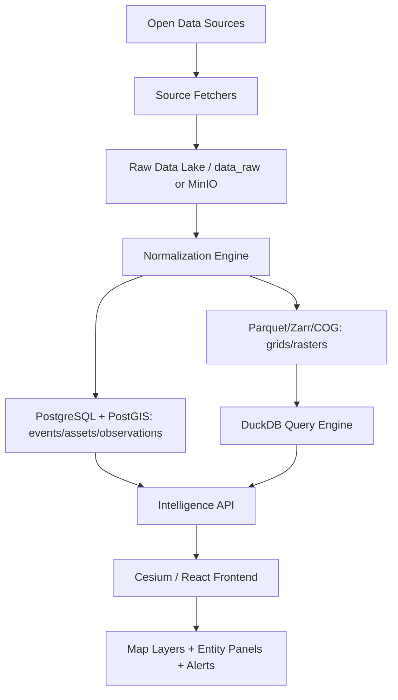
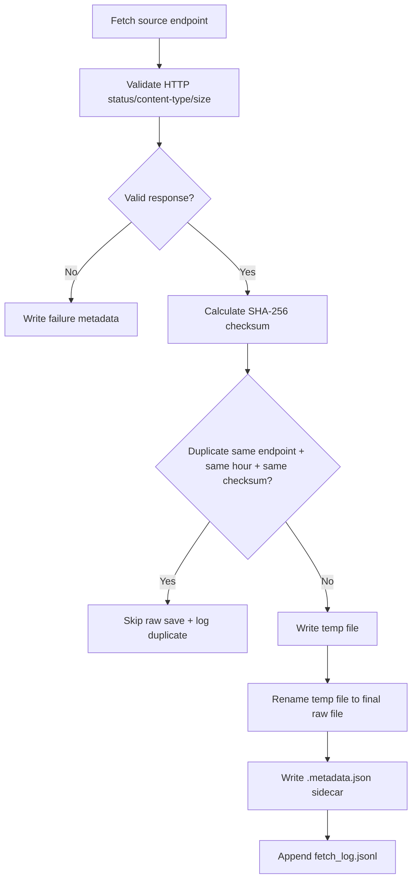
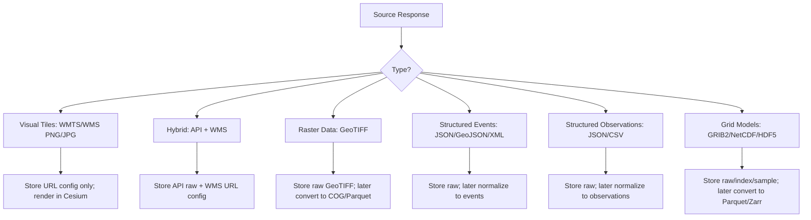

# God Eyes / Open Intelligence Earth Platform — Project Report

**Document type:** Markdown planning report  
**Scope:** Everything discussed so far about the project direction, data sources, raw-fetch pipeline, storage architecture, normalization/database roadmap, and intelligence goals.  
**Current focus:** Stage 1 — raw data fetching and raw storage for weather, hazards, disaster, and Earth-intelligence sources.

---

## 1. Project Vision

We are building a **global open-source intelligence and Earth-awareness platform**. The idea is inspired by tools like Zoom Earth for weather visualization and by intelligence platforms that fuse many types of data, but this project is based on **public, open, free, or free-tier data sources**.

The project should not be only a map. It should become a system that can answer:

```txt
What is happening here?
What changed recently?
What assets are nearby?
What hazards are active?
Who or what is affected?
How confident are we?
Which sources support this conclusion?
What should we watch next?
```

The long-term idea is:

```txt
collect → store raw → normalize → connect → compare → score → explain → alert → visualize
```

The project should eventually behave like an **open-data intelligence fusion engine**, not just a data viewer.

---

## 2. Current Repository Direction Discussed

The active development folder is:

```txt
explorer/
```

The project direction discussed so far:

```txt
Frontend:
- React
- TypeScript
- Vite
- Cesium / Resium
- Zustand-style state management
- 3D globe UI
- layer panels
- entity details panels
- telemetry / HUD panels

Backend:
- Node.js / .mjs server
- source fetchers
- raw data capture
- future normalization workers
- future Postgres/PostGIS + DuckDB + Parquet lakehouse
```

Existing project features already discussed:

```txt
- Cesium globe
- terrain / 3D Earth view
- OSM buildings
- search
- imagery picker
- live flights
- flight selection/details
- focus/track/chase/cockpit camera modes
- aviation grid
- weather fallback chain
- railway / metro / transit overlays
- server routes for multiple live intelligence layers
```

Immediate earlier recommendation:

```txt
Do not add unlimited datasets randomly.
First stabilize data architecture.
Start with aviation intelligence UI, weather/hazard raw fetch, source health, and fetch pipeline reliability.
```

---

## 3. Platform Domains / Factors We Want To Cover

The platform is not only weather. The full intelligence scope includes:

```txt
1. Weather / atmosphere
2. Radar / precipitation
3. Satellite imagery
4. Clouds / smoke / dust / ash
5. Earthquakes
6. Volcanoes
7. Tsunami
8. Wildfire
9. Floods / hydrology
10. Ocean / marine hazards
11. Air quality / health environment
12. Climate / historical anomaly
13. Land / vegetation / agriculture
14. Population / exposure / vulnerability
15. Critical infrastructure
16. Aviation
17. Maritime / ships / ports
18. Roads / rail / transit
19. Energy / power / pipelines
20. News / events / geopolitics
21. Conflict / protests / humanitarian risk
22. Economy / trade / supply chain
23. Military / restricted aviation indicators where public/open data allows
24. Alerts / warnings / official emergency signals
25. Derived intelligence scores and risk products
```

Important distinction:

```txt
Weather = atmosphere
Hydrology = water on land
Geology = Earth crust
Marine = ocean
Fire = fire + land + weather
Environment = air/land quality
Disaster = impact on people/assets
```

Frontend can show these under a friendly section like:

```txt
Weather & Disasters
```

Backend should keep them separated internally.

---

## 4. High-Level Architecture Diagram



Core principle:

```txt
Raw files are truth.
Normalized records are usable data.
Database stores relationships.
Parquet stores huge grids.
DuckDB queries analytics.
Frontend visualizes only.
```

---

## 5. Lakehouse Architecture Decision

The selected architecture is a **Data Lakehouse** pattern.

```txt
Raw lake:
- data_raw/ locally first
- MinIO/S3 later
- raw JSON, GeoJSON, XML, CSV, GRIB2, NetCDF, HDF5, GeoTIFF exactly as received

Database:
- PostgreSQL + PostGIS for events, assets, observations, alerts, relationships

Analytical lake:
- Parquet / Zarr / COG for huge grids and rasters

Query engine:
- DuckDB for Parquet and large analytical queries

Frontend:
- Cesium renders layers and calls backend intelligence APIs
```

Why this is correct:

```txt
Do not put huge weather grids into PostgreSQL.
Do not force every source into one format.
Do not normalize before saving raw.
Do not download every tile blindly.
```

---

## 6. Stage Plan

```txt
Stage 1: Raw fetch + raw storage
Stage 2: Normalization engine
Stage 3: Database schema + insertion
Stage 4: Query engine + source fusion
Stage 5: Intelligence products + alerts
Stage 6: Frontend visualization + investigation workflows
```

Current conversation and implementation focus:

```txt
Stage 1 only.
No database.
No normalization.
No frontend wiring.
```

---

## 7. Stage 1 Raw Fetch Pipeline

Stage 1 goal:

```txt
Fetch data from sources.
Validate it lightly.
Save raw response exactly as received.
Write metadata sidecar.
Write JSONL fetch log.
Deduplicate identical payloads.
Keep failures isolated.
Do not normalize.
```

Stage 1 flow:



Mandatory Stage 1 rules:

```txt
1. Save raw before normalization.
2. Never change raw files.
3. Never mix sources in one folder.
4. Always write metadata sidecar.
5. Always write fetch log.
6. Use safe temp-file write + rename.
7. Use checksums to dedupe.
8. Use failure isolation.
9. Use retry/backoff later for production hardening.
10. Keep data_raw out of Git.
```

---

## 8. Raw Folder Structure

The chosen folder structure:

```txt
explorer/data_raw/weather/
  <source>/
    <folder_or_dataType>/
      year=YYYY/
        month=MM/
          day=DD/
            hour=HH/
              <source>_<datatype>_<timestamp>.<ext>
              <source>_<datatype>_<timestamp>.<ext>.metadata.json
```

Example:

```txt
explorer/data_raw/weather/gdacs/cyclones/year=2026/month=04/day=30/hour=19/gdacs_cyclones_7d_2026-04-30T19-14-57-293Z.xml
explorer/data_raw/weather/gdacs/cyclones/year=2026/month=04/day=30/hour=19/gdacs_cyclones_7d_2026-04-30T19-14-57-293Z.xml.metadata.json
```

Earlier conceptual structure:

```txt
/data/raw/
 └── weather/
      ├── open_meteo/
      ├── noaa_nws/
      ├── noaa_gfs/
      ├── noaa_ncei/
      ├── copernicus_era5/
      ├── nasa_gpm/
      ├── earthquakes/usgs/
      ├── fires/nasa_firms/
      ├── alerts/gdacs/
      ├── oceans/noaa_dart/
      ├── oceans/noaa_ndbc/
      ├── hydrology/usgs_water/
      ├── hydrology/noaa_nwps/
      ├── hydrology/copernicus_glofas/
      ├── air_quality/openaq/
      ├── air_quality/copernicus_cams/
      ├── satellite/nasa_gibs/
      ├── satellite/noaa_goes/
      ├── satellite/nasa_modis/
      ├── cyclones/noaa_nhc/
      ├── cyclones/jtwc/
      ├── geology/usgs_volcano/
      ├── geology/smithsonian_gvp/
      ├── land/copernicus_land/
      └── population/worldpop/
```

Final implementation can be either grouped by source-first or domain-first, but the rule remains:

```txt
One source must have a clean isolated raw folder.
```

---

## 9. Metadata Sidecar Standard

Current metadata example shape:

```json
{
  "source": "gdacs",
  "folder": "cyclones",
  "dataType": "cyclones_7d",
  "expected": "GDACS tropical cyclones in the last week RSS/XML feed.",
  "endpoint": "https://gdacs.org/xml/rss_tc_7d.xml",
  "fetchedAt": "2026-04-30T19:14:57.293Z",
  "status": "success",
  "httpStatus": 200,
  "httpStatusText": "OK",
  "contentType": "application/xml",
  "bytes": 1021,
  "checksumSha256": "...",
  "durationMs": 202,
  "rawFilePath": "...",
  "metadataPath": "...",
  "sampleShape": {
    "kind": "rss_or_xml",
    "itemCount": 0,
    "preview": "<?xml version=..."
  }
}
```

This was judged correct.

Recommended additions for later:

```txt
runId
attempt
isDuplicate
isValid
validationError
isEmpty
emptyReason
savedAt
retentionTier
expiresAt
fetcherVersion
apiVersion or datasetVersion
```

Important rule:

```txt
itemCount = 0 is not failure.
It means valid empty feed.
```

---

## 10. Retention Policy

Basic policy discussed:

```txt
Tier 1 / Tier 2 JSON/XML/CSV raw files:
- keep full raw files for 30 days
- optionally keep one daily snapshot for 6–12 months

Tier 3 huge GRIB2/NetCDF raw files:
- keep full raw files for 7 days
- optionally keep one representative model-cycle sample/index

Tier 4 / Tier 5 static or slow data:
- keep longer if not huge
- keep metadata/version references
```

Never blindly delete:

```txt
- last successful file
- metadata logs
- daily snapshot if configured
```

---

## 11. Fetch Reliability Safeguards

Safeguards discussed:

```txt
Pre-save validation:
- HTTP status == 200
- expected content-type
- file size > 0
- JSON parse if JSON
- XML/RSS shape if XML
- CSV header if CSV
- binary magic/extension checks for GRIB/NetCDF/HDF/GeoTIFF later
- reject HTML error pages pretending to be data

Deduplication:
- endpoint + SHA-256 checksum + same hour
- skip identical data

Safe write:
- write temp file
- rename to final

Failure isolation:
- one bad feed must not stop the rest

Retry/backoff:
- 1 min, 2 min, 4 min, 8 min, 16 min
- jitter recommended

Dead-letter queue:
- source_id
- endpoint
- retry count
- last error
- last success

Circuit breaker:
- if repeated failures, stop hitting that source temporarily
```

---

## 12. Fetch Frequency Tiers

| Tier | Frequency | Sources / Examples | Purpose |
|---|---:|---|---|
| Tier 1 | 1–15 min / adaptive | USGS earthquakes, NWS alerts, GDACS, FIRMS, DART/NDBC | emergency/event feeds |
| Tier 2 | 10–60 min | Open-Meteo current, OpenAQ, USGS Water, NWPS, NASA GPM | operational observations |
| Tier 3 | model cycle | GFS, NHC/JTWC cyclone advisories | forecast cycles |
| Tier 4 | daily / 12h–daily | ERA5, CAMS, GloFAS, MODIS | slow analytical products |
| Tier 5 | weekly/monthly/yearly | volcano references, land cover, WorldPop | static/reference data |

Specific schedule decisions:

```txt
USGS Earthquakes → 1–5 min
NOAA/NWS Alerts → 2–5 min
GDACS → 5–10 min
NASA FIRMS → 10–15 min
NOAA DART/NDBC → 15–60 min normal, 1–2 min during tsunami trigger
Open-Meteo current → 10–15 min
Open-Meteo forecast → 1 hour
USGS Water → 15–60 min
OpenAQ → 30–60 min
NOAA NWPS → 1 hour
NASA GPM/IMERG → 30–60 min
NOAA GFS → 4x/day after release
NHC/JTWC → 6h normal, 1–3h near landfall
ERA5 → daily/batch
CAMS → 12h–daily
GloFAS → 6–24h/daily
MODIS → 1–2 days
Smithsonian/USGS Volcano reference → weekly
Copernicus Land → monthly
WorldPop → yearly/metadata first
```

Adaptive triggers:

```txt
Earthquake magnitude > 6.5 near ocean → DART polling 1–2 min
Active cyclone near land → cyclone polling 1–3h
Flood warning active → USGS Water/NWPS polling 15 min
Severe weather alert active → NWS alerts 2–5 min
Large wildfire detected → increase fire + wind/weather regional checks
```

---

## 13. Source Type Handling



Type groups:

```txt
TYPE_A = visual tiles
- NASA GIBS
- possible GOES tile products

TYPE_B = hybrid
- NASA FIRMS
- Copernicus GloFAS

TYPE_C = raster data
- WorldPop
- Copernicus Land

TYPE_D = structured events
- USGS Earthquake
- GDACS
- USGS Volcano
- NWS alerts

TYPE_E = structured observations
- Open-Meteo
- OpenAQ
- USGS Water
- NOAA NWPS

TYPE_F = grid models
- NOAA GFS
- ERA5
- CAMS
- GPM
```

---

## 14. 21 Main Sources Discussed

| # | Source | Main use | Access status |
|---:|---|---|---|
| 1 | Open-Meteo | current/hourly/daily weather | no API key |
| 2 | NOAA/NWS API | U.S. alerts, forecasts, observations | no key, User-Agent required |
| 3 | NOAA NCEI CDO | historical climate/weather | API token required |
| 4 | NOAA NODD/GFS | global forecast model data | public cloud/file access |
| 5 | NASA GIBS/Worldview | satellite imagery layers | public tiles; some Earthdata auth for advanced data |
| 6 | NOAA GOES | geostationary satellite files | public S3 |
| 7 | NASA FIRMS | active fires | free MAP_KEY required |
| 8 | USGS Earthquake | earthquake feeds/details | no key |
| 9 | USGS Water | stream gauges/water data | no key |
| 10 | NOAA NWPS/NWM | river forecasts/flood stage | public access |
| 11 | NOAA DART/NDBC | tsunami/ocean buoy data | public access |
| 12 | Copernicus ERA5/CDS | reanalysis/climate baselines | account/token/job API |
| 13 | Copernicus CAMS | air quality/aerosols/smoke/dust | account/token/job API |
| 14 | OpenAQ | ground air quality observations | API key required |
| 15 | Copernicus Land/CLMS | land cover/soil/vegetation/snow | account may be required depending product |
| 16 | NASA MODIS/Earthdata | NDVI/EVI/LST/fire/snow products | Earthdata account/token for many downloads |
| 17 | Smithsonian GVP | volcano reference/reports | public |
| 18 | USGS Volcano Hazards | volcano alerts/notices | public |
| 19 | GDACS | global disaster alerts | public feeds |
| 20 | Copernicus EMS/GloFAS | flood monitoring/forecasts | account/job/API access |
| 21 | WorldPop | population/exposure grids | public metadata/downloads |

Access grouping:

```txt
No-auth/direct:
- Open-Meteo
- NOAA/NWS
- NOAA NODD/GFS listings/indexes
- NASA GIBS public tiles/capabilities
- NOAA GOES public S3 metadata/listings
- USGS Earthquake
- USGS Water
- NOAA NWPS
- NOAA DART/NDBC
- Smithsonian GVP
- USGS Volcano
- GDACS
- WorldPop metadata/download references

API key/token required:
- NOAA NCEI
- NASA FIRMS
- OpenAQ

Account/job/heavy-data workflow:
- Copernicus ERA5/CDS
- Copernicus CAMS
- Copernicus GloFAS
- NASA MODIS/Earthdata
- Copernicus Land partial
- NASA GIBS advanced Earthdata products partial
```

---

## 15. No-Auth Weather Source Fetchers V1 Plan

The no-auth fetcher plan was reviewed and accepted.

Target files:

```txt
explorer/source-fetchers/weather/config/watch_locations.json
explorer/source-fetchers/weather/config/no_auth_source_manifest.mjs

open_meteo_fetcher.mjs
noaa_nws_fetcher.mjs
noaa_nodd_gfs_fetcher.mjs
nasa_gibs_fetcher.mjs
noaa_goes_fetcher.mjs
usgs_earthquake_fetcher.mjs
usgs_water_fetcher.mjs
noaa_nwps_fetcher.mjs
noaa_dart_fetcher.mjs
smithsonian_gvp_fetcher.mjs
usgs_volcano_fetcher.mjs
gdacs_fetcher.mjs
worldpop_fetcher.mjs
```

Design choices:

```txt
- location APIs use configurable watch_locations.json
- huge sources use metadata/index/sample fetches only in v1
- no full GRIB2/NetCDF/GeoTIFF/tile bulk ingestion yet
- raw capture only
- no DB
- no normalization
- no frontend wiring
```

---

## 16. Common Functions Refactor Plan

Shared helper folder:

```txt
explorer/source-fetchers/weather/common_functions/
```

Planned helper modules:

```txt
time.mjs
names.mjs
paths.mjs
checksum.mjs
http_client.mjs
shape_detector.mjs
duplicate_detector.mjs
fetch_log.mjs
failure_writer.mjs
raw_writer.mjs
feed_runner.mjs
cli_summary.mjs
index.mjs
```

Recommended additions:

```txt
config_validator.mjs
content-type to extension map
streaming checksum support
max response size guard
AbortController timeout support
per-feed rate limit config
file lock / safe temp rename
log levels
source health summary
retry/backoff hooks
```

Goal:

```txt
Each source fetcher should mostly contain:
- FEEDS config
- rare source-specific URL builders/discovery logic
- runner function
```

---

## 17. Current Raw Fetch Implementation Status Discussed

Implemented and reported:

```txt
usgs_fetcher.mjs
gdacs_fetcher.mjs
```

Reported behavior:

```txt
- saves raw outputs under explorer/data_raw/weather
- fetches USGS earthquakes, earthquake details, water values, volcano status, elevated volcanoes, notices
- fetches GDACS all-events, earthquakes, cyclones, floods, volcano feeds, wildfire map data
- writes raw files exactly as received
- writes .metadata.json sidecars
- appends to explorer/data_raw/weather/fetch_log.jsonl
- dedupes identical same-hour payloads by endpoint + SHA-256 checksum
- failures isolated
- data_raw/ added to .gitignore
```

Reported verification:

```txt
node --check passed
USGS live run: 8 success
GDACS live run: 8 success
duplicate run: duplicates skipped/logged
failure isolation: 1 failed, other feeds continued
npm run build passed
graphify update . passed
```

---

## 18. Coverage Status Discussed

The raw-fetch stage does not normalize all final fields yet.

Important numbers discussed:

```txt
Total planned parameter/data items in weather.txt: 283
Covered by current no-auth organizations: 134 / 283 mapped to at least one direct/no-auth source
Not covered by no-auth batch: 149 / 283 need later sources or later phases
Actual raw/sample rows reached: 229 / 283
```

Reason the remaining rows are not simple raw-fetch rows:

```txt
- some are derived intelligence outputs
- some require local/national sources
- some require async/job-style catalog workflows
- some are huge raster/product downloads
- some are expensive/limited/BYOK sources
```

Accepted decisions:

```txt
National/local operational data priority:
1. United States first
2. India second
3. global best-effort later

Copernicus ERA5/CAMS/EWDS:
- keep catalog proof for now
- do not implement real job submission until storage is designed

Derived fields:
- count as normalization/analytics phase
- not raw-fetch phase

Expensive/limited sources:
- free/open only first
- BYOK/freemium optional later

Last hard rows:
1. US + India
2. global free sources
3. optional BYOK
```

---

## 19. Weather/Hazard Master Categories

The master parameter list covers:

```txt
Atmospheric basics:
- temperature
- humidity
- pressure
- wind
- clouds
- visibility

Precipitation:
- rain
- snow
- sleet
- freezing rain
- hail
- precipitation probability/type/intensity/accumulation

Severe weather:
- thunderstorms
- lightning
- CAPE/CIN
- tornado/supercell/microburst/downburst risk

Cyclones:
- location
- track
- forecast cone
- category
- intensity
- pressure
- surge

Radar/satellite:
- reflectivity
- velocity
- visible/IR/water vapor imagery
- cloud mask/motion winds
- smoke/dust/ash

Earthquakes/tsunami:
- magnitude
- depth
- time
- shaking
- aftershocks
- tsunami alerts/wave height/arrival

Volcanoes:
- status
- alert level
- eruptions
- ash cloud
- SO2 plume
- lava/lahar risk

Fires:
- active fire
- FRP
- brightness
- confidence
- fire perimeter
- burned area
- spread direction/speed

Air quality:
- AQI
- PM2.5
- PM10
- ozone
- NO2
- SO2
- CO
- aerosols

Hydrology/floods:
- river level/discharge
- gauges
- runoff
- groundwater
- reservoirs
- flood extent/depth/probability

Marine/ocean:
- waves
- swell
- tides
- currents
- SST
- sea ice
- iceberg

Land/environment:
- NDVI/EVI
- soil moisture
- drought
- land cover/use
- forest cover
- deforestation
- DEM/slope/aspect/drainage

Exposure/impact:
- population density
- vulnerable population
- infrastructure
- roads/bridges/ports/airports
- hospitals/shelters/schools

Historical/climate:
- disaster history
- storm tracks
- rainfall/temperature history
- anomalies
- climate normals

Derived intelligence:
- risk score
- hazard severity
- exposure score
- vulnerability score
- confidence score
- data freshness
- source reliability
```

---

## 20. Full Master Parameter Source Map From `weather.txt`

The current `weather.txt` parameter map is included below as the working master list for Stage 1 planning and later normalization design.

| Parameter / data item             | Best source/database to search first                                             |
| --------------------------------- | -------------------------------------------------------------------------------- |
| temperature                       | Open-Meteo, NOAA GFS, ERA5, NWS                                                  |
| feels-like temperature            | Open-Meteo, calculate from temperature/humidity/wind                             |
| heat index                        | Open-Meteo or calculate from temperature + humidity                              |
| wind chill                        | Open-Meteo or calculate from temperature + wind                                  |
| wet-bulb temperature              | Calculate from temperature + humidity + pressure; ERA5/Open-Meteo inputs         |
| dew point                         | Open-Meteo, NOAA GFS, ERA5                                                       |
| relative humidity                 | Open-Meteo, NOAA GFS, ERA5                                                       |
| specific humidity                 | NOAA GFS, ERA5                                                                   |
| atmospheric pressure              | Open-Meteo, NOAA GFS, ERA5                                                       |
| sea-level pressure                | Open-Meteo, NOAA GFS, ERA5                                                       |
| surface pressure                  | Open-Meteo, NOAA GFS, ERA5                                                       |
| pressure tendency                 | Calculate from pressure time series; NWS observations, ERA5                      |
| wind speed                        | Open-Meteo, NOAA GFS, ERA5                                                       |
| wind direction                    | Open-Meteo, NOAA GFS, ERA5                                                       |
| wind gusts                        | Open-Meteo, NOAA GFS, ERA5                                                       |
| wind shear                        | NOAA GFS upper-air fields, ERA5 pressure levels                                  |
| jet stream wind                   | NOAA GFS upper-air wind, ERA5 pressure levels                                    |
| cloud cover                       | Open-Meteo, NOAA GFS, NASA GIBS, GOES                                            |
| cloud type                        | NOAA satellite products, NASA GIBS, GOES                                         |
| cloud base height                 | NOAA GFS, aviation weather products, NWS                                         |
| cloud top height                  | GOES, NASA GIBS, NOAA satellite products                                         |
| cloud top temperature             | GOES infrared, NASA GIBS infrared layers                                         |
| visibility                        | Open-Meteo, NWS observations, NOAA GFS                                           |
| fog                               | Open-Meteo weather code, NOAA GFS visibility/humidity, NWS                       |
| mist                              | Open-Meteo weather code, NWS observations                                        |
| haze                              | NWS observations, CAMS aerosols, OpenAQ                                          |
| rainfall                          | Open-Meteo, NOAA GFS, ERA5, NWS                                                  |
| rain rate                         | Radar/RainViewer, NOAA MRMS/NEXRAD, GFS precipitation rate                       |
| rain accumulation                 | Open-Meteo, NOAA GFS, ERA5, NWS                                                  |
| precipitation probability         | Open-Meteo, NWS, GFS ensemble products                                           |
| precipitation type                | Open-Meteo, NOAA GFS, NWS                                                        |
| convective precipitation          | NOAA GFS, ERA5                                                                   |
| stratiform precipitation          | NOAA GFS, ERA5                                                                   |
| freezing rain                     | NOAA GFS, NWS alerts, Open-Meteo if available                                    |
| sleet                             | NOAA GFS, NWS, Open-Meteo weather code                                           |
| hail                              | NOAA severe weather products, NWS alerts, radar-derived products                 |
| snowfall                          | Open-Meteo, NOAA GFS, ERA5                                                       |
| snow rate                         | NOAA GFS, NWS, radar precipitation classification                                |
| snow accumulation                 | Open-Meteo, NOAA GFS, ERA5                                                       |
| snow depth                        | Open-Meteo, NOAA GFS, ERA5, Copernicus Land                                      |
| snow water equivalent             | NOAA GFS, ERA5-Land, Copernicus Land                                             |
| blizzard conditions               | Derived from snow + wind + visibility; NWS alerts                                |
| ice accumulation                  | NOAA GFS, NWS alerts                                                             |
| thunderstorm probability          | NOAA GFS convective products, NWS alerts                                         |
| lightning strikes                 | Vaisala/Blitzortung-style networks, NASA LIS historical, national met agencies   |
| lightning density                 | Lightning network data, NASA LIS historical                                      |
| CAPE                              | NOAA GFS, ERA5                                                                   |
| CIN                               | NOAA GFS, ERA5                                                                   |
| lifted index                      | NOAA GFS, ERA5                                                                   |
| storm helicity                    | NOAA GFS, ERA5                                                                   |
| storm cell location               | Radar products, NOAA MRMS/NEXRAD, national radar services                        |
| storm cell track                  | Radar-derived storm tracking, NOAA MRMS/NEXRAD                                   |
| storm cell intensity              | Radar reflectivity, echo tops, lightning density                                 |
| supercell risk                    | Derived from CAPE + shear + helicity + radar                                     |
| tornado risk                      | NOAA SPC products, NWS alerts, derived severe-weather model fields               |
| severe thunderstorm warnings      | NWS API, GDACS for broad disaster context                                        |
| hail probability                  | NOAA SPC/NWS, radar products, model severe parameters                            |
| hail size estimate                | Radar-derived products, NWS storm reports                                        |
| microburst risk                   | Derived from CAPE + downdraft CAPE + radar + wind shear                          |
| downburst risk                    | Derived from DCAPE + storm radar + wind fields                                   |
| cyclone location                  | NOAA NHC, JTWC, GDACS, national cyclone centers                                  |
| cyclone track                     | NOAA NHC, JTWC, GDACS                                                            |
| cyclone forecast cone             | NOAA NHC, JTWC, national cyclone agencies                                        |
| cyclone intensity                 | NOAA NHC, JTWC, GDACS                                                            |
| cyclone wind radius               | NOAA NHC, JTWC                                                                   |
| cyclone pressure                  | NOAA NHC, JTWC, GFS                                                              |
| cyclone category                  | NOAA NHC, JTWC, GDACS                                                            |
| hurricane track                   | NOAA NHC                                                                         |
| typhoon track                     | JTWC, JMA, GDACS                                                                 |
| tropical depression               | NOAA NHC, JTWC, JMA                                                              |
| tropical storm                    | NOAA NHC, JTWC, JMA                                                              |
| storm surge                       | NOAA/NHC, NOAA NOS, GFS coastal models                                           |
| storm tide                        | NOAA tide gauges, NOAA NOS, NHC products                                         |
| coastal flooding                  | NOAA/NWS alerts, NOAA NWPS/NWM, Copernicus EMS                                   |
| radar reflectivity                | NOAA NEXRAD/MRMS, RainViewer, national radar services                            |
| radar precipitation intensity     | NOAA MRMS/NEXRAD, RainViewer                                                     |
| radar velocity                    | NOAA NEXRAD Level II                                                             |
| radar echo tops                   | NOAA MRMS/NEXRAD                                                                 |
| radar storm tracks                | NOAA MRMS/NEXRAD-derived products                                                |
| radar rain/snow classification    | NOAA MRMS/NEXRAD, RainViewer where available                                     |
| satellite visible imagery         | NASA GIBS, NOAA GOES, Himawari, Meteosat                                         |
| satellite infrared imagery        | NASA GIBS, NOAA GOES, Himawari, Meteosat                                         |
| satellite water vapor imagery     | NOAA GOES, NASA GIBS, Himawari, Meteosat                                         |
| satellite true color imagery      | NASA GIBS/Worldview, GOES true-color products                                    |
| satellite cloud mask              | NASA MODIS, NOAA GOES products                                                   |
| satellite cloud motion winds      | NOAA GOES atmospheric motion vectors                                             |
| satellite rainfall estimate       | NASA GPM/IMERG, NOAA satellite precipitation products                            |
| satellite sea surface temperature | NASA MODIS, NOAA satellite SST products, Copernicus Marine                       |
| satellite fire detection          | NASA FIRMS, MODIS/VIIRS                                                          |
| satellite smoke detection         | NASA GIBS, CAMS aerosols, GOES imagery                                           |
| satellite dust detection          | NASA GIBS, CAMS aerosols, GOES imagery                                           |
| satellite ash detection           | NOAA volcanic ash products, NASA GIBS, CAMS                                      |
| weather alerts                    | NWS API, national weather agencies, GDACS                                        |
| weather watches                   | NWS API, national weather agencies                                               |
| weather warnings                  | NWS API, national weather agencies, GDACS                                        |
| emergency alerts                  | GDACS, FEMA/OpenFEMA, national emergency agencies                                |
| meteorological advisories         | NWS, national weather agencies                                                   |
| aviation weather advisories       | NOAA Aviation Weather Center, METAR/TAF feeds, NWS                               |
| marine weather warnings           | NOAA/NWS marine, national marine weather agencies                                |
| fire weather warnings             | NWS fire weather alerts, national weather agencies                               |
| flood warnings                    | NOAA/NWS, NOAA NWPS, Copernicus GloFAS, GDACS                                    |
| heat warnings                     | NWS API, national weather agencies                                               |
| cold warnings                     | NWS API, national weather agencies                                               |
| earthquake location               | USGS Earthquake API, GDACS                                                       |
| earthquake magnitude              | USGS Earthquake API, GDACS                                                       |
| earthquake depth                  | USGS Earthquake API                                                              |
| earthquake time                   | USGS Earthquake API                                                              |
| earthquake intensity              | USGS ShakeMap products, USGS event details                                       |
| earthquake shaking map            | USGS ShakeMap                                                                    |
| earthquake aftershocks            | USGS Earthquake API/event catalog                                                |
| earthquake fault line             | USGS fault databases, GEM Global Active Faults                                   |
| earthquake focal mechanism        | USGS event details, GCMT catalog                                                 |
| earthquake tsunami potential      | USGS event details, NOAA Tsunami Warning Center, GDACS                           |
| tsunami warning                   | NOAA Tsunami Warning Center, GDACS                                               |
| tsunami watch                     | NOAA Tsunami Warning Center, GDACS                                               |
| tsunami advisory                  | NOAA Tsunami Warning Center, GDACS                                               |
| tsunami wave height               | NOAA DART/NDBC, tsunami warning centers                                          |
| tsunami arrival time              | NOAA Tsunami Warning Center, GDACS                                               |
| volcano location                  | Smithsonian GVP, NOAA volcano location database                                  |
| volcano status                    | Smithsonian GVP, USGS Volcano Hazards Program                                    |
| volcano alert level               | USGS Volcano, national volcano observatories                                     |
| volcanic eruption event           | Smithsonian GVP, USGS Volcano, GDACS                                             |
| volcanic ash cloud                | NOAA volcanic ash advisories, VAACs, NASA GIBS                                   |
| volcanic ash height               | VAACs, USGS Volcano notices                                                      |
| volcanic ash forecast             | VAACs, NOAA/NWS aviation products                                                |
| volcanic gas emissions            | USGS Volcano, CAMS SO2, NASA satellite SO2 products                              |
| volcanic SO2 plume                | CAMS, NASA Aura/OMI/TROPOMI products                                             |
| lava flow                         | USGS Volcano, local volcano observatories, satellite imagery                     |
| lahar risk                        | USGS Volcano, local geological agencies                                          |
| landslide location                | NASA landslide catalog, USGS landslide program, GDACS when available             |
| landslide susceptibility          | NASA landslide susceptibility, USGS, World Bank/HDX hazard layers                |
| landslide warning                 | National geological/weather agencies                                             |
| mudslide risk                     | Derived from rainfall + slope + soil + land cover                                |
| rockfall risk                     | Geological agencies, terrain slope + earthquake/rain triggers                    |
| ground deformation                | Copernicus Land ground motion, InSAR products, USGS Volcano                      |
| subsidence                        | Copernicus Land ground motion, InSAR products                                    |
| active fire location              | NASA FIRMS                                                                       |
| fire radiative power              | NASA FIRMS                                                                       |
| fire brightness temperature       | NASA FIRMS                                                                       |
| fire confidence                   | NASA FIRMS                                                                       |
| fire perimeter                    | National fire agencies, NASA/USFS for U.S., Copernicus EMS mapping               |
| burned area                       | NASA MODIS burned area, Copernicus Land, ESA Fire CCI                            |
| fire spread direction             | Derived from active fires + wind + fuel/vegetation                               |
| fire spread speed                 | Derived from fire detections over time + wind/fuel                               |
| fire weather index                | Copernicus CEMS Fire, national fire weather systems                              |
| fuel moisture                     | Copernicus Land, NOAA/NASA land products, national fire agencies                 |
| vegetation dryness                | NASA MODIS NDVI/EVI, Copernicus Land, drought products                           |
| drought index                     | Copernicus Drought Observatory, NOAA drought products, SPEI datasets             |
| soil moisture                     | Copernicus Land, ERA5-Land, SMAP/NASA                                            |
| rainfall deficit                  | ERA5, CHIRPS, NOAA/NCEI, Open-Meteo historical                                   |
| evapotranspiration                | MODIS, ERA5-Land, Copernicus Land                                                |
| vegetation health index           | NOAA STAR VHI, MODIS NDVI-derived                                                |
| NDVI                              | NASA MODIS, Copernicus Sentinel-2                                                |
| EVI                               | NASA MODIS                                                                       |
| crop stress                       | FAO, Copernicus Land, MODIS NDVI/EVI, GEOGLAM                                    |
| heatwave                          | Derived from temperature + climate normals; ERA5/NCEI                            |
| cold wave                         | Derived from temperature + climate normals; ERA5/NCEI                            |
| drought                           | Copernicus Drought Observatory, NOAA drought, SPEI                               |
| flash drought                     | Soil moisture + evapotranspiration + rainfall anomaly                            |
| dust storm                        | CAMS aerosols, NASA GIBS, GOES imagery                                           |
| sandstorm                         | CAMS aerosols, NASA GIBS, GOES imagery                                           |
| smoke plume                       | NASA GIBS, CAMS aerosols, FIRMS + wind                                           |
| smoke concentration               | CAMS, national air-quality models                                                |
| aerosol optical depth             | CAMS, NASA MODIS/AERONET                                                         |
| air quality index                 | OpenAQ, national AQ APIs, calculated from pollutants                             |
| PM2.5                             | OpenAQ, CAMS                                                                     |
| PM10                              | OpenAQ, CAMS                                                                     |
| ozone                             | OpenAQ, CAMS                                                                     |
| nitrogen dioxide                  | OpenAQ, CAMS, TROPOMI satellite                                                  |
| sulfur dioxide                    | OpenAQ, CAMS, TROPOMI/OMI satellite                                              |
| carbon monoxide                   | OpenAQ, CAMS, TROPOMI/MOPITT                                                     |
| carbon dioxide                    | CAMS greenhouse gas products, NOAA GML, OCO-2/OCO-3                              |
| methane                           | CAMS greenhouse gas products, TROPOMI, GHGSat public products where available    |
| pollen                            | Open-Meteo pollen where available, national health/weather agencies              |
| allergen level                    | Pollen datasets, national health/weather agencies                                |
| UV index                          | Open-Meteo, CAMS, national weather agencies                                      |
| solar radiation                   | Open-Meteo, ERA5, NASA POWER                                                     |
| surface radiation                 | ERA5, NASA POWER, CAMS radiation products                                        |
| river level                       | USGS Water, NOAA NWPS, national hydrology agencies                               |
| river discharge                   | USGS Water, NOAA NWM/NWPS, GloFAS                                                |
| river flow                        | USGS Water, NOAA NWM, GloFAS                                                     |
| river flood stage                 | NOAA NWPS, USGS Water, national hydrology agencies                               |
| river forecast                    | NOAA NWPS/NWM, GloFAS                                                            |
| stream gauge level                | USGS Water, national hydrology agencies                                          |
| watershed boundary                | USGS hydrologic units, HydroSHEDS                                                |
| basin rainfall                    | GFS, ERA5, IMERG, CHIRPS                                                         |
| surface runoff                    | ERA5-Land, NOAA NWM, GloFAS                                                      |
| groundwater level                 | USGS Water, national groundwater agencies                                        |
| reservoir level                   | National water agencies, USGS where available                                    |
| dam level                         | National dam/water agencies                                                      |
| dam release                       | National/local dam operators, water agencies                                     |
| lake level                        | USGS Water, national hydrology agencies, satellite altimetry                     |
| flood extent                      | Copernicus EMS Global Flood Monitoring, satellite SAR/optical products           |
| flood depth                       | Copernicus EMS, hydrodynamic models, local flood agencies                        |
| flood probability                 | GloFAS, NOAA NWPS, derived from forecast + terrain                               |
| flash flood risk                  | NOAA/NWS, GloFAS, derived rainfall + terrain + soil                              |
| urban flood risk                  | Derived from rainfall + DEM + drainage + land cover                              |
| coastal flood risk                | NOAA coastal models, tide gauges, storm surge products                           |
| sea level anomaly                 | NOAA altimetry, Copernicus Marine                                                |
| tide level                        | NOAA CO-OPS, national tide gauges                                                |
| high tide                         | NOAA CO-OPS, national tide agencies                                              |
| low tide                          | NOAA CO-OPS, national tide agencies                                              |
| wave height                       | NOAA NDBC, NOAA WaveWatch III, Copernicus Marine                                 |
| wave direction                    | NOAA WaveWatch III, Copernicus Marine                                            |
| wave period                       | NOAA WaveWatch III, Copernicus Marine                                            |
| swell height                      | NOAA WaveWatch III, Copernicus Marine                                            |
| swell direction                   | NOAA WaveWatch III, Copernicus Marine                                            |
| ocean current speed               | Copernicus Marine, NOAA ocean models                                             |
| ocean current direction           | Copernicus Marine, NOAA ocean models                                             |
| sea surface temperature           | NOAA OISST, NASA MODIS, Copernicus Marine                                        |
| sea ice concentration             | NSIDC, Copernicus Marine, NOAA                                                   |
| sea ice extent                    | NSIDC, Copernicus Marine                                                         |
| sea ice thickness                 | CryoSat/ESA, Copernicus Marine, NSIDC                                            |
| iceberg location                  | U.S. National Ice Center, Copernicus Marine                                      |
| glacier change                    | NASA Earthdata, WGMS, Copernicus Land                                            |
| avalanche risk                    | National avalanche centers, mountain weather services                            |
| avalanche warning                 | National avalanche centers                                                       |
| permafrost thaw                   | NASA Earthdata, ESA/Copernicus climate datasets                                  |
| land surface temperature          | NASA MODIS, ERA5-Land, Copernicus Land                                           |
| surface albedo                    | NASA MODIS, ERA5, Copernicus Land                                                |
| land cover                        | Copernicus Land, ESA WorldCover, MODIS land cover                                |
| land use                          | Copernicus Land, OpenStreetMap, national land agencies                           |
| forest cover                      | Hansen Global Forest Change, Copernicus Land                                     |
| deforestation                     | Global Forest Watch, Hansen Global Forest Change                                 |
| desertification risk              | UNCCD datasets, Copernicus Land, drought/land-cover products                     |
| soil temperature                  | ERA5-Land, Open-Meteo, national soil networks                                    |
| soil type                         | SoilGrids/ISRIC, national soil databases                                         |
| soil erosion risk                 | ISRIC SoilGrids + slope/rainfall/land cover models                               |
| terrain elevation                 | NASA SRTM, Copernicus DEM, USGS 3DEP                                             |
| slope                             | Derived from DEM                                                                 |
| aspect                            | Derived from DEM                                                                 |
| drainage network                  | HydroSHEDS, OSM waterways, USGS NHD                                              |
| floodplain                        | Global Flood Database, FEMA for U.S., JRC flood hazard maps                      |
| coastline change                  | NOAA shoreline data, Copernicus coastal products, satellite imagery              |
| storm damage reports              | NWS storm reports, FEMA/OpenFEMA, GDACS                                          |
| disaster declarations             | FEMA/OpenFEMA, national disaster agencies                                        |
| evacuation zones                  | Local/state emergency agencies, FEMA where available                             |
| evacuation routes                 | OpenStreetMap, local emergency agencies                                          |
| shelter locations                 | FEMA/OpenFEMA, local emergency agencies, HDX                                     |
| hospital locations                | OpenStreetMap, HDX health facilities, WHO/HDX                                    |
| school locations                  | OpenStreetMap, HDX, national education datasets                                  |
| critical infrastructure           | OpenStreetMap, OpenInfraMap, national infrastructure datasets                    |
| power plant locations             | OpenStreetMap, OpenInfraMap, Global Energy Monitor                               |
| substation locations              | OpenStreetMap, OpenInfraMap                                                      |
| power line locations              | OpenStreetMap, OpenInfraMap                                                      |
| pipeline locations                | OpenStreetMap, national pipeline datasets                                        |
| road closures                     | Local/state DOT APIs, Open511 where available, traffic agencies                  |
| bridge closures                   | Local/state DOT APIs, Open511, transportation agencies                           |
| airport status                    | FAA/NAS Status for U.S., airport APIs, NOTAM sources                             |
| port status                       | Port authority feeds, AIS/MarineCadastre, UN/World Bank port datasets            |
| rail disruption                   | Transit GTFS-realtime, rail agency feeds                                         |
| communication tower locations     | OpenCelliD, FCC ASR for U.S., OpenStreetMap                                      |
| population density                | WorldPop, GHSL, LandScan where licensed                                          |
| population exposure               | WorldPop + hazard polygons                                                       |
| vulnerable population             | WorldPop age/sex where available, census/HDX datasets                            |
| nighttime lights                  | NASA Black Marble/VIIRS night lights                                             |
| building footprints               | OpenStreetMap, Microsoft Global ML Building Footprints, Google Open Buildings    |
| building height                   | OpenStreetMap where tagged, national 3D building datasets, LiDAR where available |
| economic exposure                 | World Bank, GDP grids, GAR risk datasets                                         |
| agricultural exposure             | FAOSTAT, Copernicus Land, MODIS crop/vegetation products                         |
| crop area                         | Copernicus Land, FAO, national agriculture datasets                              |
| livestock density                 | FAO Gridded Livestock of the World                                               |
| historical disaster events        | EM-DAT, GDACS archive, NOAA NCEI storm events                                    |
| historical storm tracks           | NOAA IBTrACS, NHC best track                                                     |
| historical rainfall               | ERA5, NOAA NCEI, CHIRPS                                                          |
| historical temperature            | ERA5, NOAA NCEI                                                                  |
| historical flood extent           | Dartmouth Flood Observatory, Copernicus EMS archive                              |
| historical fire scars             | MODIS burned area, ESA Fire CCI                                                  |
| historical earthquake catalog     | USGS Earthquake Catalog, ISC-GEM                                                 |
| historical volcano eruptions      | Smithsonian GVP                                                                  |
| climate normals                   | NOAA NCEI, WMO, ERA5-derived normals                                             |
| temperature anomaly               | ERA5/CDS, NOAA NCEI, calculate from normals                                      |
| rainfall anomaly                  | ERA5, CHIRPS, NOAA NCEI                                                          |
| drought anomaly                   | Copernicus Drought Observatory, SPEI, soil moisture anomaly                      |
| sea surface temperature anomaly   | NOAA OISST, Copernicus Marine                                                    |
| vegetation anomaly                | MODIS NDVI/EVI anomaly, Copernicus Land                                          |
| risk score                        | Calculate internally from hazard × exposure × vulnerability × confidence         |
| hazard severity                   | Calculate internally from hazard-specific thresholds                             |
| exposure score                    | Calculate internally from population/infrastructure/assets intersecting hazard   |
| vulnerability score               | Calculate internally from demographics, poverty, infrastructure, terrain         |
| confidence score                  | Calculate internally from source reliability + freshness + agreement             |
| data freshness                    | Store internally from source timestamp and fetch timestamp                       |
| source reliability                | Store internally in your source registry                                         |

---

## 21. Intelligence Workflows Planned

The app should eventually support workflows, not only map layers.

### Location Intelligence

```txt
Click anywhere on Earth
→ current weather
→ nearby hazards
→ nearby flights
→ nearby airports/ports/roads/hospitals
→ population estimate
→ latest news/events
→ risk score
→ evidence list
```

### Asset Intelligence

```txt
Click airport / port / ship / aircraft / city / power plant
→ current status
→ nearby hazards
→ activity trend
→ related news
→ connected infrastructure
→ anomaly score
```

### Event Intelligence

```txt
Click storm / fire / earthquake / protest / outage
→ event summary
→ affected population
→ nearby infrastructure
→ transportation disruption
→ timeline
→ similar past events
→ confidence by source
```

### Route Intelligence

```txt
Select two points
→ weather risk
→ conflict/disaster risk
→ terrain risk
→ population centers crossed
→ alternate routes
```

### Watch Zones

```txt
User defines:
- India
- Bay of Bengal
- Kolkata airport
- Mumbai port
- custom polygon

Backend monitors:
- fires
- storms
- earthquakes
- flight disruptions
- ship congestion
- news spikes
```

### What Changed in 24 Hours

```txt
For a place/region:
- new hazards
- weather changes
- news spikes
- aircraft/ship anomalies
- risk movement
- affected infrastructure/population
```

---

## 22. Future Normalization Stage Preview

Not part of current Stage 1, but already discussed.

Normalization must eventually do:

```txt
1. unit standardization
2. UTC time normalization
3. spatial normalization using H3
4. schema mapping from source keys to canonical keys
5. source priority / apex rules
6. fallback handling
7. event deduplication
8. grid alignment / resampling
9. confidence scoring
10. write clean data to Postgres/Parquet
```

Key idea:

```txt
Raw source key → canonical parameter
Open-Meteo temperature_2m → temperature
GFS tmp → temperature
ERA5 t2m → temperature
```

Future `apex_rules.json` idea:

```json
{
  "parameters": {
    "temperature": {
      "primary_source": "open_meteo",
      "fallback_1": "noaa_gfs",
      "fallback_2": "era5"
    },
    "surface_pressure": {
      "primary_source": "era5",
      "fallback_1": "noaa_gfs",
      "fallback_2": "open_meteo"
    }
  }
}
```

Derived values should not be fetched directly:

```txt
risk score
confidence score
hazard severity
exposure score
vulnerability score
spread speed
slope
aspect
source reliability
```

These belong to analytics/normalization later.

---

## 23. Future Database Direction Preview

Not part of Stage 1, but discussed as the likely architecture.

Planned Postgres/PostGIS tables:

```txt
sources
ingestion_runs
intel_events
intel_assets
intel_observations
intel_alerts
intel_relationships
```

Grid/large files:

```txt
Parquet / Zarr / COG in data lake
Queried by DuckDB
```

Important fields later:

```txt
source_id
raw_file_path
ingestion_run_id
observed_time
valid_time
forecast_time
ingested_at
h3_res5
h3_res6
h3_res7
h3_res8
h3_res9
confidence
payload JSONB
```

---

## 24. Visual Layer Strategy

Visual/image sources are handled differently from raw data sources.

```txt
NASA GIBS / Worldview:
- pure visual WMTS/WMS tiles
- pass URL template to Cesium
- do not bulk-download all tiles

NASA FIRMS:
- API for fire coordinates
- WMS/MVT for visual overlay

Copernicus GloFAS:
- raw/model data for intelligence later
- WMS-T for visual flood layers where useful

GeoTIFF sources:
- WorldPop
- Copernicus Land
- raster data is raw numerical image-like data, not normal photo imagery
```

Rendering rules:

```txt
Events → Cesium points/entities
Observations → markers/heatmaps
Grids → sampled values or raster layers
Tiles → direct WMTS/WMS overlays
```

---

## 25. Aviation Intelligence Direction

Aviation was one of the earliest strong areas in the existing repo.

Planned/mentioned aviation intelligence:

```txt
- live aircraft positions
- aircraft details panel
- owner/operator
- registration
- aircraft type
- squawk
- military flag
- LADD flag
- PIA flag
- emergency indicators
- nearest airport
- weather around aircraft
- route if known
- anomaly/risk notes
```

Data sources discussed:

```txt
OpenSky Network
OurAirports
FAA/DOT/BTS where useful
weather/radar overlays for aviation risk
```

Aviation risk examples:

```txt
flight path crosses severe storm
+ wind gusts / turbulence risk
+ diversion behavior
= aviation risk alert
```

---

## 26. Maritime / Marine Intelligence Direction

Marine and maritime intelligence should include:

```txt
ships
ports
waves
currents
tides
storm surge
tsununami/coastal warnings
sea surface temperature
weather/ocean risk
```

Sources discussed:

```txt
Global Fishing Watch
MarineCadastre AIS
NOAA marine data
OpenStreetMap ports
UN/World Bank trade context
NOAA NDBC/DART buoys
Copernicus Marine later
```

Maritime risk example:

```txt
cyclone path + high waves + active port + many ships = maritime disruption risk
```

---

## 27. Health / Population / Humanitarian Direction

Health/environment/population intelligence should include:

```txt
population density
vulnerable population
hospitals
schools
shelters
health facilities
AQI
PM2.5
PM10
smoke exposure
heat risk
flood/fire exposure
```

Sources discussed:

```txt
WorldPop
HDX
UN OCHA CODs
WHO
World Bank
OpenAQ
CAMS
OpenStreetMap
```

Impact example:

```txt
wildfire + wind toward city + PM2.5 increase + population density = public health risk
```

---

## 28. Geopolitics / News / Conflict Direction

Geopolitical and event intelligence should be handled responsibly.

Sources discussed:

```txt
GDELT
ACLED
UCDP
ReliefWeb
Wikipedia Current Events
news RSS feeds
HDX
```

Use cases:

```txt
conflict/protest events
humanitarian risk
news spike detection
region summary
entity extraction
source corroboration
```

Important warning:

```txt
News/event feeds are signals, not truth.
Show confidence and source agreement.
```

---

## 29. Infrastructure / Energy / Transportation Direction

Infrastructure factors discussed:

```txt
power plants
substations
power lines
pipelines
roads
bridges
rail
ports
airports
communication towers
hospitals
shelters
schools
```

Sources discussed:

```txt
OpenStreetMap
OpenInfraMap
EIA
Global Energy Monitor
Data.Transportation.gov
Open511 where available
GTFS / GTFS-Realtime
Mobility Database
OpenRailwayMap
FAA/NAS status
port authorities
```

Risk example:

```txt
fire near power line + high wind + nearby population = infrastructure risk alert
```

---

## 30. Economy / Trade / Agriculture Direction

Economic and agricultural context sources discussed:

```txt
World Bank
IMF
UN Comtrade
OECD
FAOSTAT
EIA
PortWatch / World Bank where available
Copernicus Land
MODIS
FAO livestock/crop datasets
```

Use cases:

```txt
supply-chain risk
port disruption impact
crop stress
agricultural exposure
commodity/energy context
```

---

## 31. Trust, Provenance, and Ethics

Every intelligence result should answer:

```txt
Where did this come from?
When was it updated?
How confident are we?
Which sources agree?
Which sources disagree?
What changed?
```

Every record should eventually track:

```txt
source
raw_file_path
ingestion_run_id
fetched_at
observed_time
valid_time
source reliability
confidence
```

Ethical boundaries:

```txt
Good uses:
- disaster response
- weather risk
- transport disruption
- infrastructure exposure
- humanitarian awareness
- environmental monitoring
- supply-chain risk
- research

Avoid:
- tracking private individuals
- doxxing
- targeting people
- weaponizing location data
- bypassing access controls
- scraping restricted systems
- claiming certainty from weak signals
```

---

## 32. Major Risks To Watch

```txt
1. Over-scope: trying all 283 items at once
2. Storage explosion from GRIB2/NetCDF/GeoTIFF
3. API limits and provider terms
4. Schema drift from source APIs
5. Duplicate events across sources
6. Raw file corruption from partial writes
7. Mixing normalization into fetch stage too early
8. Treating news/event feeds as verified truth
9. Not separating visual tiles from data
10. No source health dashboard
11. No retention policy
12. No canonical schema in Stage 2
13. No grid alignment strategy later
14. No alert deduplication later
```

---

## 33. Immediate Next Steps

Stage 1 next steps:

```txt
1. Finish common_functions refactor
2. Implement no-auth fetchers V1
3. Add config/watch_locations.json
4. Add no_auth_source_manifest.mjs
5. Add validation for feed configs
6. Add streaming-safe writer for future large files
7. Add source health summary per run
8. Keep no-auth sources tiny/sample/index-only where needed
9. Confirm raw folders + metadata + log + dedupe + failure isolation
10. Do not start normalization until Stage 1 is clean
```

Stage 2 future start:

```txt
1. canonical schema
2. parameter registry
3. apex_rules.json
4. unit conversion
5. UTC time conversion
6. H3 strategy
7. event/observation/grid split
8. source priority/fallback
9. normalized output files
```

---

## 34. Five-Pass Review Summary

```txt
Pass 1 — Project vision:
- Confirmed this is an open-data Earth intelligence platform, not only weather.

Pass 2 — Source coverage:
- Confirmed 21 main weather/hazard sources and many future intelligence sources.

Pass 3 — Stage 1 pipeline:
- Confirmed fetch, raw save, metadata, dedupe, validation, retention, failure isolation.

Pass 4 — Implementation status:
- Captured USGS/GDACS fetchers, common_functions refactor, no-auth fetcher V1 plan, coverage numbers.

Pass 5 — Gaps and next movement:
- Stage 1 is correct.
- Main future work is normalization, canonical schema, H3, database, and intelligence scoring.
```

---

## 35. Final Current Status

```txt
Stage 1 architecture: approved
Raw fetch logic: correct
Current USGS/GDACS implementation: strong
No-auth V1 plan: accepted
weather.txt parameter map: master source of truth for now
Normalization: not started yet
Database: not started yet
Frontend integration: not part of this stage
```

Final one-line project definition:

```txt
God Eyes is a Cesium-based open-source Earth intelligence platform that fetches public weather, hazard, infrastructure, population, aviation, maritime, news, and conflict data; stores raw evidence safely; normalizes it later into a unified intelligence model; and visualizes risks, events, and relationships on a 3D globe.
```
